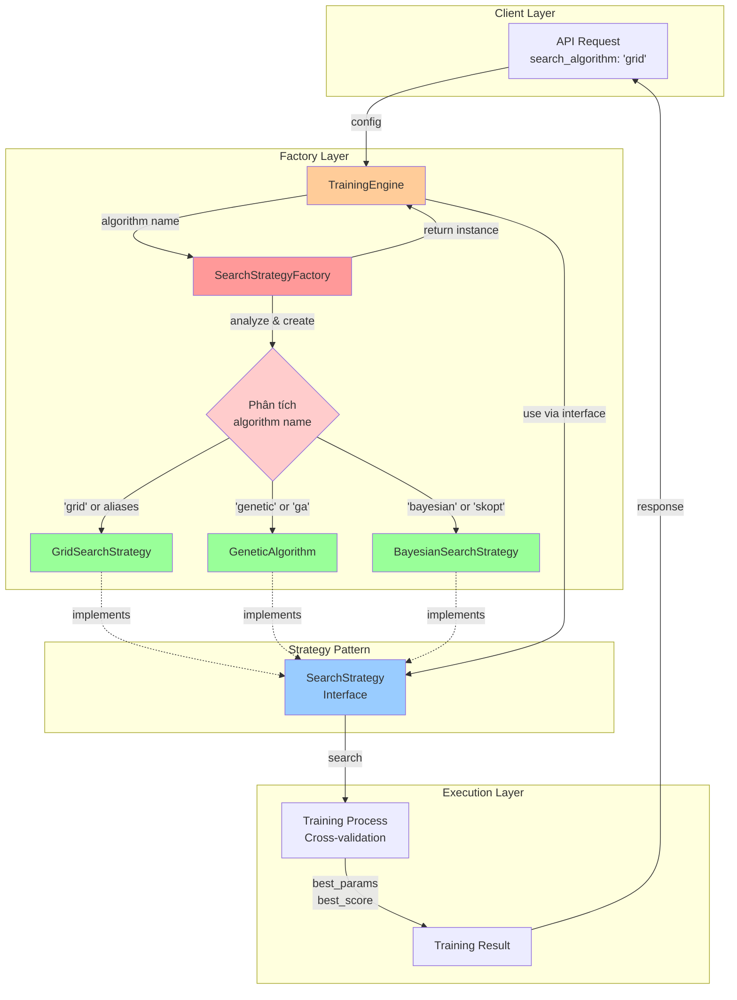
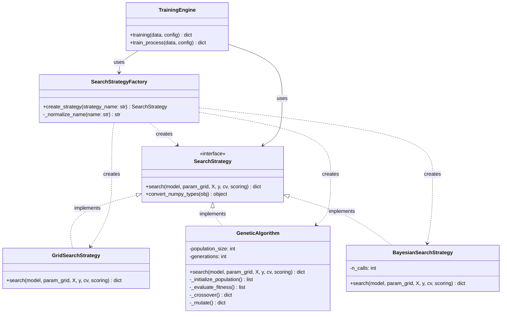
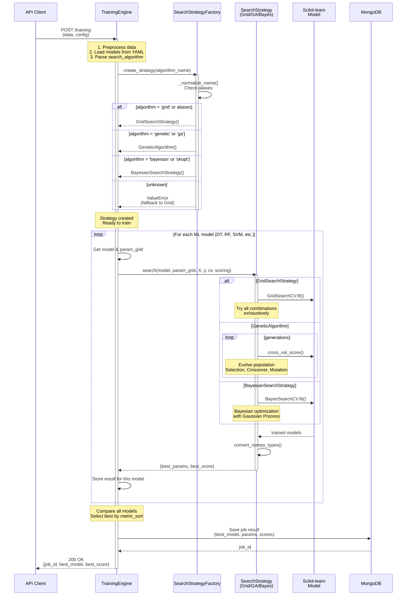
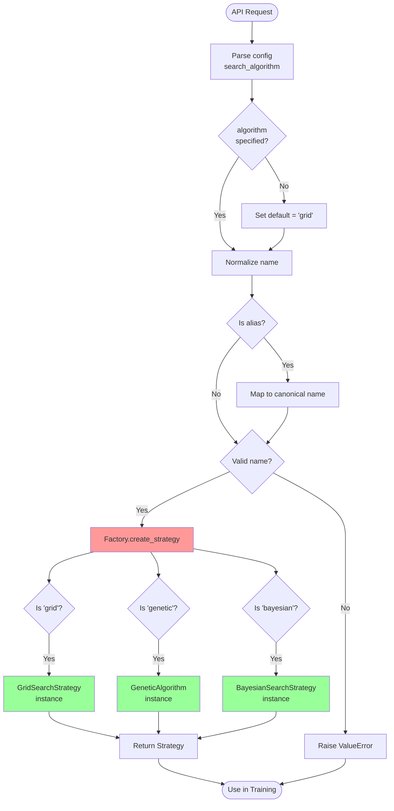
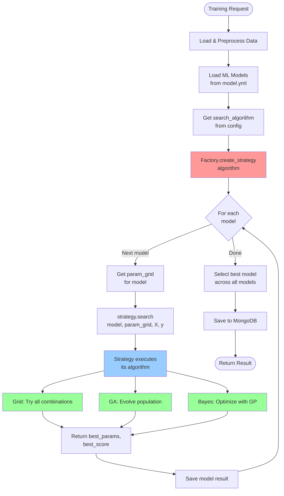
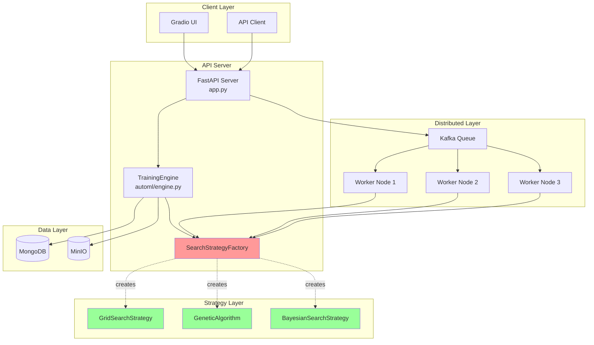

# Design Document: Kiến Trúc Design Patterns trong HAutoML

## Overview

Hệ thống HAutoML sử dụng kết hợp Factory Pattern và Strategy Pattern để tạo ra một kiến trúc linh hoạt, dễ mở rộng cho việc chuyển đổi giữa các thuật toán tìm kiếm siêu tham số. Document này cung cấp các sơ đồ chi tiết và giải thích về cách các patterns này được triển khai và tương tác với nhau.

## Architecture

### 1. Tổng Quan Kiến Trúc Design Patterns



**Giải thích:**

1. **Client Layer**: API nhận request với config chứa `search_algorithm`

2. **Factory Layer**: 
   - TrainingEngine gọi SearchStrategyFactory với tên thuật toán
   - Factory phân tích tên (normalize, check aliases)
   - Factory tạo instance của Strategy tương ứng (Grid/GA/Bayes)

3. **Strategy Pattern**: 
   - Tất cả Concrete Strategies implement SearchStrategy interface
   - Đảm bảo contract thống nhất: phương thức `search()` và `convert_numpy_types()`

4. **Execution Layer**:
   - Factory trả Strategy instance về cho Engine
   - Engine sử dụng Strategy thông qua interface (không biết concrete type)
   - Strategy thực hiện tìm kiếm siêu tham số với cross-validation
   - Trả kết quả về Client

**Lợi ích của kiến trúc:**
- **Loose Coupling**: Engine không phụ thuộc vào concrete strategies
- **Open/Closed Principle**: Thêm strategy mới không cần sửa Engine code
- **Runtime Flexibility**: Chuyển đổi thuật toán chỉ bằng cách thay đổi config

### 2. Class Diagram - Mối Quan Hệ Giữa Các Components



**Giải thích:**
- **SearchStrategy**: Interface định nghĩa contract chung cho tất cả strategies
- **Concrete Strategies**: Mỗi strategy implement phương thức `search()` theo cách riêng
- **Factory**: Tạo instance của strategy dựa trên tên, che giấu logic khởi tạo
- **TrainingEngine**: Sử dụng Factory để tạo strategy và gọi thông qua interface

### 3. Sequence Diagram - Luồng Tạo và Sử Dụng Strategy (Tổng Thể)



**Giải thích luồng tổng thể:**

1. **Request Phase**: Client gửi request với data và config (bao gồm `search_algorithm`)

2. **Preparation Phase**: 
   - Engine preprocess dữ liệu (encoding, scaling)
   - Load danh sách models từ `model.yml`
   - Parse `search_algorithm` từ config

3. **Strategy Creation Phase**:
   - Factory nhận tên thuật toán
   - Normalize và check aliases
   - Tạo Strategy instance tương ứng (Grid/GA/Bayes)
   - Fallback về Grid nếu tên không hợp lệ

4. **Training Phase** (lặp cho mỗi model):
   - Engine gọi `strategy.search()` với model và param_grid
   - Strategy thực hiện thuật toán riêng của nó:
     - **Grid**: Thử tất cả combinations
     - **GA**: Evolve population qua nhiều generations
     - **Bayes**: Optimize với Gaussian Process
   - Strategy trả về best_params và best_score

5. **Selection Phase**:
   - Engine so sánh kết quả của tất cả models
   - Chọn model tốt nhất theo `metric_sort`

6. **Persistence Phase**:
   - Lưu kết quả vào MongoDB
   - Trả về job_id và thông tin model tốt nhất cho client

**Điểm quan trọng:**
- Factory Pattern cho phép chuyển đổi linh hoạt giữa các strategies
- Strategy Pattern đảm bảo interface thống nhất dù thuật toán khác nhau
- Client không cần biết implementation details của từng strategy

## Components and Interfaces

### 1. SearchStrategyFactory - Factory Pattern Implementation

```python
# File: automl/search/factory/search_strategy_factory.py

class SearchStrategyFactory:
    """
    Factory tạo Search Strategy dựa trên tên thuật toán.
    Hỗ trợ nhiều alias cho mỗi thuật toán để tăng tính linh hoạt.
    """
    
    # Mapping từ tên chuẩn hóa sang Strategy class
    _strategies = {
        'grid': GridSearchStrategy,
        'genetic': GeneticAlgorithm,
        'bayesian': BayesianSearchStrategy,
    }
    
    # Aliases cho các thuật toán
    _aliases = {
        'gridsearch': 'grid',
        'ga': 'genetic',
        'geneticalgorithm': 'genetic',
        'bayes': 'bayesian',
        'bayesianoptimization': 'bayesian',
        'skopt': 'bayesian',
    }
    
    @staticmethod
    def create_strategy(strategy_name: str) -> SearchStrategy:
        """
        Tạo Strategy instance dựa trên tên.
        
        Args:
            strategy_name: Tên thuật toán (không phân biệt hoa thường)
            
        Returns:
            Instance của SearchStrategy
            
        Raises:
            ValueError: Nếu tên thuật toán không được hỗ trợ
        """
        normalized = SearchStrategyFactory._normalize_name(strategy_name)
        
        if normalized in SearchStrategyFactory._strategies:
            return SearchStrategyFactory._strategies[normalized]()
        
        raise ValueError(f"Unknown search strategy: {strategy_name}")
    
    @staticmethod
    def _normalize_name(name: str) -> str:
        """Chuẩn hóa tên thuật toán: lowercase và xử lý aliases"""
        name_lower = name.lower().replace('_', '').replace('-', '')
        return SearchStrategyFactory._aliases.get(name_lower, name_lower)
```

**Ưu điểm của thiết kế này:**
- **Tách biệt logic tạo đối tượng**: Client không cần biết cách khởi tạo Strategy
- **Dễ mở rộng**: Thêm thuật toán mới chỉ cần update `_strategies` dict
- **Linh hoạt với aliases**: Hỗ trợ nhiều cách gọi tên cho cùng một thuật toán
- **Type safety**: Trả về interface chung, đảm bảo contract

### 2. SearchStrategy Interface - Strategy Pattern

```python
# File: automl/search/strategy/search_strategy.py

from abc import ABC, abstractmethod
from typing import Any, Dict
import numpy as np

class SearchStrategy(ABC):
    """
    Interface chung cho tất cả Search Strategies.
    Định nghĩa contract mà mọi strategy phải tuân theo.
    """
    
    @abstractmethod
    def search(
        self,
        model: Any,
        param_grid: Dict,
        X: np.ndarray,
        y: np.ndarray,
        cv: int = 5,
        scoring: str = 'accuracy'
    ) -> Dict:
        """
        Tìm kiếm siêu tham số tốt nhất cho model.
        
        Args:
            model: ML model instance
            param_grid: Dictionary của parameters cần tìm kiếm
            X: Training features
            y: Training labels
            cv: Number of cross-validation folds
            scoring: Metric để đánh giá
            
        Returns:
            Dictionary chứa:
            - best_params: Siêu tham số tốt nhất
            - best_score: Score tốt nhất
            - cv_results: Kết quả chi tiết (optional)
        """
        pass
    
    @staticmethod
    def convert_numpy_types(obj: Any) -> Any:
        """
        Convert numpy types sang Python native types.
        Cần thiết cho JSON serialization.
        """
        if isinstance(obj, np.integer):
            return int(obj)
        elif isinstance(obj, np.floating):
            return float(obj)
        elif isinstance(obj, np.ndarray):
            return obj.tolist()
        elif isinstance(obj, dict):
            return {key: SearchStrategy.convert_numpy_types(value) 
                    for key, value in obj.items()}
        elif isinstance(obj, list):
            return [SearchStrategy.convert_numpy_types(item) for item in obj]
        return obj
```

### 3. Concrete Strategies Implementation

#### GridSearchStrategy - Tìm Kiếm Toàn Diện

```python
# File: automl/search/strategy/grid_search_strategy.py

from sklearn.model_selection import GridSearchCV
from .search_strategy import SearchStrategy

class GridSearchStrategy(SearchStrategy):
    """
    Strategy sử dụng Grid Search để tìm kiếm toàn bộ không gian tham số.
    Phù hợp khi: Không gian tham số nhỏ, cần kết quả chính xác nhất.
    """
    
    def search(self, model, param_grid, X, y, cv=5, scoring='accuracy'):
        # Tạo GridSearchCV instance
        grid_search = GridSearchCV(
            estimator=model,
            param_grid=param_grid,
            cv=cv,
            scoring=scoring,
            n_jobs=-1,  # Sử dụng tất cả CPU cores
            verbose=1
        )
        
        # Thực hiện tìm kiếm
        grid_search.fit(X, y)
        
        # Trả về kết quả đã convert
        return {
            'best_params': self.convert_numpy_types(grid_search.best_params_),
            'best_score': float(grid_search.best_score_),
            'cv_results': self.convert_numpy_types(grid_search.cv_results_)
        }
```

**Đặc điểm:**
- Tìm kiếm toàn bộ tổ hợp tham số
- Đảm bảo tìm được optimal trong không gian định nghĩa
- Thời gian tăng theo cấp số nhân với số tham số

#### GeneticAlgorithm - Tìm Kiếm Tiến Hóa

```python
# File: automl/search/strategy/genetic_algorithm.py

import random
from sklearn.model_selection import cross_val_score
from .search_strategy import SearchStrategy

class GeneticAlgorithm(SearchStrategy):
    """
    Strategy sử dụng Genetic Algorithm để tìm kiếm.
    Phù hợp khi: Không gian tham số lớn, cần kết quả nhanh.
    """
    
    def __init__(self, population_size=20, generations=10):
        self.population_size = population_size
        self.generations = generations
    
    def search(self, model, param_grid, X, y, cv=5, scoring='accuracy'):
        # Initialize population
        population = self._initialize_population(param_grid)
        best_individual = None
        best_score = float('-inf')
        
        for generation in range(self.generations):
            # Evaluate fitness
            fitness_scores = []
            for individual in population:
                model.set_params(**individual)
                scores = cross_val_score(model, X, y, cv=cv, scoring=scoring)
                fitness = scores.mean()
                fitness_scores.append(fitness)
                
                if fitness > best_score:
                    best_score = fitness
                    best_individual = individual.copy()
            
            # Selection, Crossover, Mutation
            population = self._evolve_population(
                population, fitness_scores, param_grid
            )
        
        return {
            'best_params': self.convert_numpy_types(best_individual),
            'best_score': float(best_score)
        }
    
    def _initialize_population(self, param_grid):
        """Tạo population ban đầu ngẫu nhiên"""
        population = []
        for _ in range(self.population_size):
            individual = {}
            for param, values in param_grid.items():
                individual[param] = random.choice(values)
            population.append(individual)
        return population
    
    def _evolve_population(self, population, fitness_scores, param_grid):
        """Selection, Crossover, Mutation"""
        # Tournament selection
        new_population = []
        for _ in range(self.population_size):
            # Select parents
            parent1 = self._tournament_select(population, fitness_scores)
            parent2 = self._tournament_select(population, fitness_scores)
            
            # Crossover
            child = self._crossover(parent1, parent2)
            
            # Mutation
            child = self._mutate(child, param_grid)
            
            new_population.append(child)
        
        return new_population
```

**Đặc điểm:**
- Tìm kiếm dựa trên nguyên lý tiến hóa
- Nhanh hơn Grid Search với không gian lớn
- Không đảm bảo tìm được optimal nhưng thường cho kết quả tốt

#### BayesianSearchStrategy - Tìm Kiếm Thông Minh

```python
# File: automl/search/strategy/bayesian_search_strategy.py

from skopt import BayesSearchCV
from .search_strategy import SearchStrategy

class BayesianSearchStrategy(SearchStrategy):
    """
    Strategy sử dụng Bayesian Optimization.
    Phù hợp khi: Cần cân bằng giữa tốc độ và chất lượng.
    """
    
    def __init__(self, n_calls=50):
        self.n_calls = n_calls
    
    def search(self, model, param_grid, X, y, cv=5, scoring='accuracy'):
        # Convert param_grid to skopt format
        search_spaces = self._convert_to_search_spaces(param_grid)
        
        # Tạo BayesSearchCV instance
        bayes_search = BayesSearchCV(
            estimator=model,
            search_spaces=search_spaces,
            n_iter=self.n_calls,
            cv=cv,
            scoring=scoring,
            n_jobs=-1,
            verbose=1
        )
        
        # Thực hiện tìm kiếm
        bayes_search.fit(X, y)
        
        return {
            'best_params': self.convert_numpy_types(bayes_search.best_params_),
            'best_score': float(bayes_search.best_score_)
        }
```

**Đặc điểm:**
- Sử dụng mô hình xác suất để dự đoán vùng tham số tốt
- Hiệu quả hơn Grid Search, chính xác hơn GA
- Cân bằng exploration và exploitation

## Data Models

### Strategy Selection Flow



### Training Process with Strategy



## Error Handling

### Strategy Creation Error Handling

```python
def create_strategy_safe(strategy_name: str) -> SearchStrategy:
    """
    Wrapper an toàn cho việc tạo strategy với fallback.
    """
    try:
        return SearchStrategyFactory.create_strategy(strategy_name)
    except ValueError as e:
        # Log error
        print(f"Unknown strategy '{strategy_name}', falling back to Grid Search")
        # Fallback to default
        return GridSearchStrategy()
    except Exception as e:
        # Log unexpected error
        print(f"Error creating strategy: {e}")
        raise
```

### Strategy Execution Error Handling

```python
def execute_search_safe(strategy, model, param_grid, X, y):
    """
    Thực hiện search với error handling.
    """
    try:
        result = strategy.search(model, param_grid, X, y)
        return result
    except Exception as e:
        # Log error với context
        print(f"Search failed for {model.__class__.__name__}: {e}")
        # Return default result
        return {
            'best_params': {},
            'best_score': 0.0,
            'error': str(e)
        }
```

## Testing Strategy

### Unit Tests cho Factory

```python
def test_factory_creates_grid_strategy():
    strategy = SearchStrategyFactory.create_strategy('grid')
    assert isinstance(strategy, GridSearchStrategy)

def test_factory_handles_aliases():
    strategy1 = SearchStrategyFactory.create_strategy('GA')
    strategy2 = SearchStrategyFactory.create_strategy('genetic')
    assert type(strategy1) == type(strategy2)

def test_factory_raises_on_unknown():
    with pytest.raises(ValueError):
        SearchStrategyFactory.create_strategy('unknown_algo')
```

### Integration Tests cho Strategy

```python
def test_strategy_returns_valid_result():
    from sklearn.datasets import load_iris
    from sklearn.tree import DecisionTreeClassifier
    
    X, y = load_iris(return_X_y=True)
    model = DecisionTreeClassifier()
    param_grid = {'max_depth': [3, 5, 7]}
    
    strategy = GridSearchStrategy()
    result = strategy.search(model, param_grid, X, y)
    
    assert 'best_params' in result
    assert 'best_score' in result
    assert result['best_score'] > 0
```

## Extending the System

### Thêm Thuật Toán Mới

**Bước 1: Tạo Strategy Class**

```python
# File: automl/search/strategy/random_search_strategy.py

from sklearn.model_selection import RandomizedSearchCV
from .search_strategy import SearchStrategy

class RandomSearchStrategy(SearchStrategy):
    """Strategy sử dụng Random Search"""
    
    def __init__(self, n_iter=100):
        self.n_iter = n_iter
    
    def search(self, model, param_grid, X, y, cv=5, scoring='accuracy'):
        random_search = RandomizedSearchCV(
            estimator=model,
            param_distributions=param_grid,
            n_iter=self.n_iter,
            cv=cv,
            scoring=scoring,
            n_jobs=-1
        )
        
        random_search.fit(X, y)
        
        return {
            'best_params': self.convert_numpy_types(random_search.best_params_),
            'best_score': float(random_search.best_score_)
        }
```

**Bước 2: Đăng ký vào Factory**

```python
# File: automl/search/factory/search_strategy_factory.py

class SearchStrategyFactory:
    _strategies = {
        'grid': GridSearchStrategy,
        'genetic': GeneticAlgorithm,
        'bayesian': BayesianSearchStrategy,
        'random': RandomSearchStrategy,  # Thêm dòng này
    }
    
    _aliases = {
        # ... existing aliases ...
        'randomsearch': 'random',  # Thêm alias
        'rs': 'random',
    }
```

**Bước 3: Sử dụng**

```yaml
# config.yaml
search_algorithm: random  # Hoặc 'RandomSearch', 'rs'
```

### Tùy Chỉnh Strategy Hiện Có

```python
# Tạo custom GA với parameters khác
class FastGeneticAlgorithm(GeneticAlgorithm):
    def __init__(self):
        super().__init__(population_size=10, generations=5)

# Đăng ký
SearchStrategyFactory._strategies['fast_ga'] = FastGeneticAlgorithm
```

## Performance Considerations

### So Sánh Các Thuật Toán

| Thuật toán | Thời gian | Chất lượng | Use Case |
|------------|-----------|------------|----------|
| Grid Search | O(n^m) | Optimal | Không gian nhỏ (<100 combinations) |
| Genetic Algorithm | O(p*g*k) | Good | Không gian lớn, cần nhanh |
| Bayesian Search | O(n*log(n)) | Very Good | Cân bằng tốc độ/chất lượng |
| Random Search | O(n) | Fair | Baseline, exploration |

Trong đó:
- n: số tham số
- m: số giá trị mỗi tham số
- p: population size
- g: số generations
- k: cost của evaluation

### Optimization Tips

1. **Parallel Execution**: Tất cả strategies đều hỗ trợ `n_jobs=-1`
2. **Early Stopping**: Có thể thêm callback để dừng sớm
3. **Caching**: Cache kết quả cross-validation để tránh tính lại
4. **Distributed**: Sử dụng MapReduce pattern cho training phân tán

## Deployment Diagram



## Summary

Kiến trúc Design Patterns của HAutoML kết hợp Factory và Strategy patterns để tạo ra hệ thống:

1. **Linh hoạt**: Dễ dàng chuyển đổi giữa các thuật toán chỉ bằng cách thay đổi config
2. **Mở rộng**: Thêm thuật toán mới không ảnh hưởng code hiện có
3. **Maintainable**: Tách biệt rõ ràng giữa creation logic và execution logic
4. **Testable**: Mỗi component có thể test độc lập
5. **Scalable**: Hỗ trợ distributed training với cùng một interface

Người dùng chỉ cần chỉ định `search_algorithm` trong config, hệ thống tự động xử lý phần còn lại.
