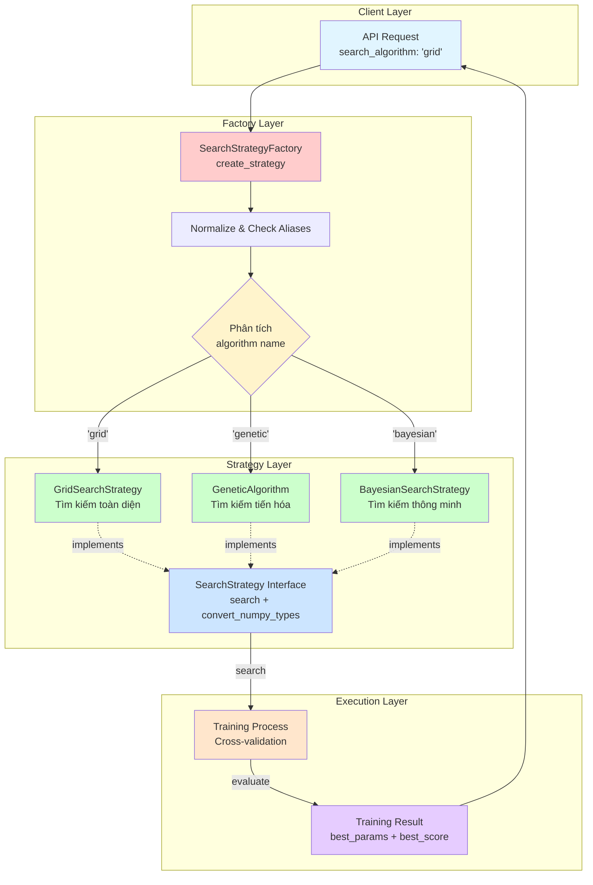
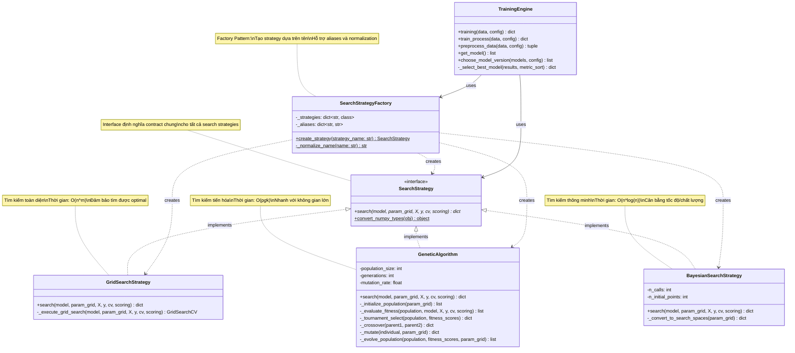
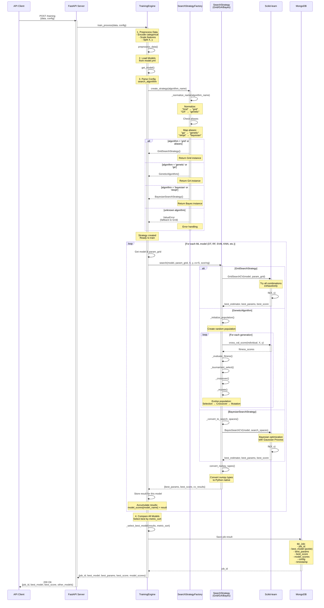
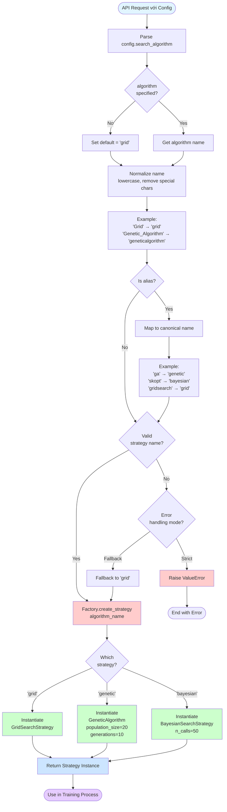

# Kiến Trúc Design Patterns trong HAutoML

## Giới Thiệu

Tài liệu này mô tả chi tiết kiến trúc Design Patterns của hệ thống HAutoML, tập trung vào cơ chế chuyển đổi linh hoạt giữa các thuật toán tìm kiếm siêu tham số. Hệ thống sử dụng kết hợp **Factory Pattern** và **Strategy Pattern** để đạt được tính linh hoạt, khả năng mở rộng và dễ bảo trì.

## 1. Tổng Quan Kiến Trúc Design Patterns

### Sơ Đồ Tổng Quan



### Giải Thích Các Layer

#### **Client Layer** (Lớp Khách Hàng)
- **Vai trò**: Điểm khởi đầu của request từ người dùng
- **Chức năng**: 
  - Gửi request với cấu hình huấn luyện
  - Chỉ định thuật toán tìm kiếm qua tham số `search_algorithm`
  - Nhận kết quả huấn luyện cuối cùng
- **Ví dụ**: API endpoint `/training-file-local` với config YAML chứa `search_algorithm: 'grid'`

#### **Factory Layer** (Lớp Nhà Máy)
- **Vai trò**: Tạo đối tượng Strategy phù hợp dựa trên tên thuật toán
- **Chức năng**:
  - **SearchStrategyFactory**: Component chính thực hiện Factory Pattern
  - **Normalize**: Chuẩn hóa tên thuật toán (lowercase, loại bỏ ký tự đặc biệt)
  - **Check Aliases**: Xử lý các tên gọi khác nhau cho cùng một thuật toán
  - **Decision**: Quyết định tạo Strategy nào dựa trên tên đã chuẩn hóa
- **Lợi ích**: 
  - Tách biệt logic tạo đối tượng khỏi logic sử dụng
  - Dễ dàng thêm thuật toán mới mà không ảnh hưởng code hiện có
  - Hỗ trợ nhiều alias cho mỗi thuật toán (ví dụ: "ga", "GA", "genetic")

#### **Strategy Layer** (Lớp Chiến Lược)
- **Vai trò**: Định nghĩa và triển khai các thuật toán tìm kiếm khác nhau
- **Chức năng**:
  - **SearchStrategy Interface**: Contract chung cho tất cả strategies
    - `search()`: Phương thức tìm kiếm siêu tham số
    - `convert_numpy_types()`: Chuyển đổi kiểu dữ liệu cho JSON serialization
  - **Concrete Strategies**: Các triển khai cụ thể
    - **GridSearchStrategy**: Tìm kiếm toàn bộ không gian tham số
    - **GeneticAlgorithm**: Tìm kiếm dựa trên thuật toán di truyền
    - **BayesianSearchStrategy**: Tìm kiếm dựa trên tối ưu hóa Bayesian
- **Lợi ích**:
  - Mỗi strategy có thể thay đổi độc lập
  - Dễ dàng test từng strategy riêng biệt
  - Client code không cần biết implementation details

#### **Execution Layer** (Lớp Thực Thi)
- **Vai trò**: Thực hiện quá trình huấn luyện với strategy đã chọn
- **Chức năng**:
  - **Training Process**: Sử dụng strategy thông qua interface
  - **Cross-validation**: Đánh giá mô hình với nhiều fold
  - **Result**: Tổng hợp kết quả tốt nhất (best_params, best_score)
- **Đặc điểm**:
  - Không phụ thuộc vào strategy cụ thể
  - Sử dụng polymorphism để gọi `strategy.search()`
  - Đảm bảo kết quả nhất quán dù thuật toán khác nhau

### Luồng Hoạt Động

1. **Client** gửi request với `search_algorithm: 'grid'`
2. **Factory** nhận tên thuật toán và chuẩn hóa
3. **Factory** kiểm tra aliases và quyết định tạo `GridSearchStrategy`
4. **Strategy** được trả về cho Execution Layer
5. **Training Process** gọi `strategy.search()` để tìm siêu tham số
6. **Strategy** thực hiện thuật toán riêng của nó
7. **Result** được trả về cho Client


## 2. Class Diagram Chi Tiết

### Sơ Đồ Lớp



### Mô Tả Chi Tiết Các Class

#### **SearchStrategy (Interface)**

Interface trừu tượng định nghĩa contract cho tất cả search strategies.

**Phương thức:**
- `search(model, param_grid, X, y, cv, scoring)`: Phương thức trừu tượng bắt buộc implement
  - **model**: Instance của ML model (DecisionTree, RandomForest, SVM, etc.)
  - **param_grid**: Dictionary chứa không gian tham số cần tìm kiếm
  - **X**: Training features (numpy array hoặc pandas DataFrame)
  - **y**: Training labels (numpy array hoặc pandas Series)
  - **cv**: Số fold cho cross-validation (mặc định 5)
  - **scoring**: Metric để đánh giá ('accuracy', 'f1', 'precision', 'recall')
  - **Return**: Dictionary chứa `best_params`, `best_score`, và optional `cv_results`

- `convert_numpy_types(obj)`: Static method chuyển đổi numpy types sang Python native
  - Cần thiết cho JSON serialization
  - Xử lý: np.integer → int, np.floating → float, np.ndarray → list
  - Đệ quy xử lý dict và list

**Vai trò**: Đảm bảo tất cả strategies tuân theo cùng một interface, cho phép polymorphism

---

#### **SearchStrategyFactory**

Factory class tạo strategy instances dựa trên tên thuật toán.

**Thuộc tính:**
- `_strategies`: Dictionary mapping từ tên chuẩn hóa sang Strategy class
  ```python
  {
      'grid': GridSearchStrategy,
      'genetic': GeneticAlgorithm,
      'bayesian': BayesianSearchStrategy
  }
  ```

- `_aliases`: Dictionary mapping từ alias sang tên chuẩn
  ```python
  {
      'gridsearch': 'grid',
      'ga': 'genetic',
      'geneticalgorithm': 'genetic',
      'bayes': 'bayesian',
      'bayesianoptimization': 'bayesian',
      'skopt': 'bayesian'
  }
  ```

**Phương thức:**
- `create_strategy(strategy_name)`: Tạo và trả về strategy instance
  - Normalize tên thuật toán
  - Check aliases
  - Instantiate class tương ứng
  - Raise ValueError nếu tên không hợp lệ

- `_normalize_name(name)`: Chuẩn hóa tên thuật toán
  - Chuyển về lowercase
  - Loại bỏ underscore và hyphen
  - Map alias sang tên chuẩn

**Vai trò**: Tách biệt logic tạo đối tượng, dễ mở rộng với thuật toán mới

---

#### **GridSearchStrategy**

Concrete strategy sử dụng Grid Search để tìm kiếm toàn bộ không gian tham số.

**Phương thức:**
- `search()`: Implement interface method
  - Sử dụng `sklearn.model_selection.GridSearchCV`
  - Thử tất cả combinations của tham số
  - Sử dụng `n_jobs=-1` để parallel execution
  - Return best_params và best_score sau khi convert types

- `_execute_grid_search()`: Helper method thực hiện grid search
  - Tạo GridSearchCV instance
  - Fit với training data
  - Extract results

**Đặc điểm:**
- **Ưu điểm**: Đảm bảo tìm được optimal trong không gian định nghĩa
- **Nhược điểm**: Thời gian tăng theo cấp số nhân với số tham số
- **Use case**: Không gian tham số nhỏ (<100 combinations), cần kết quả chính xác nhất

**Complexity**: O(n^m) với n là số giá trị mỗi tham số, m là số tham số

---

#### **GeneticAlgorithm**

Concrete strategy sử dụng Genetic Algorithm để tìm kiếm dựa trên nguyên lý tiến hóa.

**Thuộc tính:**
- `population_size`: Kích thước quần thể (mặc định 20)
- `generations`: Số thế hệ tiến hóa (mặc định 10)
- `mutation_rate`: Tỷ lệ đột biến (mặc định 0.1)

**Phương thức:**
- `search()`: Implement interface method
  - Initialize population ngẫu nhiên
  - Loop qua các generations
  - Evaluate fitness cho mỗi individual
  - Selection, crossover, mutation
  - Track best individual

- `_initialize_population()`: Tạo population ban đầu
  - Random sample từ param_grid
  - Tạo population_size individuals

- `_evaluate_fitness()`: Đánh giá fitness của population
  - Sử dụng cross_val_score
  - Return list fitness scores

- `_tournament_select()`: Chọn parent bằng tournament selection
  - Random chọn k individuals
  - Return individual có fitness cao nhất

- `_crossover()`: Lai ghép hai parents
  - Uniform crossover: random chọn param từ parent1 hoặc parent2

- `_mutate()`: Đột biến individual
  - Random thay đổi một số params với mutation_rate

- `_evolve_population()`: Tạo generation mới
  - Selection → Crossover → Mutation

**Đặc điểm:**
- **Ưu điểm**: Nhanh hơn Grid Search với không gian lớn, explore tốt
- **Nhược điểm**: Không đảm bảo optimal, cần tune hyperparameters (population_size, generations)
- **Use case**: Không gian tham số lớn, cần kết quả nhanh

**Complexity**: O(p*g*k) với p là population_size, g là generations, k là cost của evaluation

---

#### **BayesianSearchStrategy**

Concrete strategy sử dụng Bayesian Optimization để tìm kiếm thông minh.

**Thuộc tính:**
- `n_calls`: Số lần gọi objective function (mặc định 50)
- `n_initial_points`: Số điểm khởi tạo ngẫu nhiên (mặc định 10)

**Phương thức:**
- `search()`: Implement interface method
  - Convert param_grid sang skopt search spaces
  - Sử dụng `skopt.BayesSearchCV`
  - Bayesian optimization với Gaussian Process
  - Return best_params và best_score

- `_convert_to_search_spaces()`: Convert param_grid sang skopt format
  - List → Categorical
  - Range → Integer hoặc Real

**Đặc điểm:**
- **Ưu điểm**: Hiệu quả hơn Grid Search, chính xác hơn GA, cân bằng exploration/exploitation
- **Nhược điểm**: Phức tạp hơn, cần thư viện scikit-optimize
- **Use case**: Cân bằng giữa tốc độ và chất lượng

**Complexity**: O(n*log(n)) với n là số iterations

---

#### **TrainingEngine**

Component chính điều phối quá trình training.

**Phương thức:**
- `training()`: Entry point cho training process
  - Preprocess data
  - Get models từ YAML config
  - Choose model version
  - Loop qua từng model và train với strategy
  - Select best model
  - Return results

- `train_process()`: Wrapper cho training với error handling

- `preprocess_data()`: Tiền xử lý dữ liệu
  - Encode categorical features (LabelEncoder)
  - Scale features (StandardScaler)
  - Split X và y

- `get_model()`: Load models từ `assets/system_models/model.yml`

- `choose_model_version()`: Chọn models cần train
  - "new model": Train tất cả
  - ID cụ thể: Train lại model đó

- `_select_best_model()`: Chọn model tốt nhất theo metric_sort

**Vai trò**: 
- Sử dụng Factory để tạo strategy
- Gọi strategy.search() thông qua interface
- Không phụ thuộc vào strategy implementation cụ thể

### Mối Quan Hệ Giữa Các Class

1. **Implements**: Concrete strategies implement SearchStrategy interface
   - Đảm bảo contract thống nhất
   - Cho phép polymorphism

2. **Creates**: Factory creates strategy instances
   - Dependency injection
   - Loose coupling

3. **Uses**: TrainingEngine uses Factory và Strategy
   - Không biết strategy cụ thể
   - Chỉ tương tác qua interface


## 3. Sequence Diagram Tổng Thể

### Sơ Đồ Tuần Tự



### Giải Thích Chi Tiết Luồng

#### **Phase 1: Request và Initialization**

1. **Client gửi request**
   - Endpoint: `/training`, `/training-file-local`, hoặc `/train-from-requestbody-json/`
   - Payload: Data (CSV/JSON) + Config (YAML/JSON)
   - Config bao gồm: `list_feature`, `target`, `metric_sort`, `search_algorithm`

2. **API Server nhận request**
   - Validate input data
   - Parse config
   - Gọi `TrainingEngine.train_process()`

#### **Phase 2: Data Preparation**

3. **Preprocess Data**
   - **Encode categorical features**: Sử dụng LabelEncoder cho các cột categorical
   - **Scale features**: Sử dụng StandardScaler để chuẩn hóa
   - **Split X và y**: Tách features và target
   - **Result**: X (numpy array), y (numpy array)

4. **Load Models**
   - Đọc file `assets/system_models/model.yml`
   - Parse danh sách models: DecisionTree, RandomForest, SVM, KNN, LogisticRegression, GaussianNB
   - Mỗi model có param_grid riêng

#### **Phase 3: Strategy Creation (Factory Pattern)**

5. **Parse search_algorithm từ config**
   - Mặc định: "grid" nếu không chỉ định
   - Có thể là: "grid", "genetic", "bayesian", hoặc aliases

6. **Factory.create_strategy()**
   - **Normalize**: Chuyển về lowercase, loại bỏ ký tự đặc biệt
     - "Grid" → "grid"
     - "Genetic_Algorithm" → "geneticalgorithm"
   
   - **Check aliases**: Map alias sang tên chuẩn
     - "ga" → "genetic"
     - "skopt" → "bayesian"
     - "gridsearch" → "grid"
   
   - **Decision**: Tạo strategy instance tương ứng
     - "grid" → `GridSearchStrategy()`
     - "genetic" → `GeneticAlgorithm()`
     - "bayesian" → `BayesianSearchStrategy()`
   
   - **Error handling**: Nếu tên không hợp lệ
     - Raise ValueError
     - Hoặc fallback về GridSearchStrategy (tùy implementation)

7. **Return strategy instance**
   - TrainingEngine nhận strategy qua interface
   - Không biết strategy cụ thể là gì

#### **Phase 4: Training Loop (Strategy Pattern)**

8. **Loop qua từng model**
   - Lấy model class và param_grid từ config
   - Instantiate model
   - Gọi `strategy.search()`

9. **Strategy.search() execution**
   
   **Nếu GridSearchStrategy:**
   - Tạo `GridSearchCV` instance
   - Set `n_jobs=-1` để parallel
   - Gọi `fit(X, y)`
   - GridSearchCV thử tất cả combinations
   - Return `best_params`, `best_score`, `cv_results`
   
   **Nếu GeneticAlgorithm:**
   - Initialize population ngẫu nhiên
   - Loop qua generations:
     - Evaluate fitness: Gọi `cross_val_score()` cho mỗi individual
     - Selection: Tournament selection chọn parents
     - Crossover: Lai ghép parents tạo children
     - Mutation: Đột biến children với mutation_rate
     - Replace population với generation mới
   - Track best individual qua các generations
   - Return `best_params`, `best_score`
   
   **Nếu BayesianSearchStrategy:**
   - Convert param_grid sang skopt search spaces
   - Tạo `BayesSearchCV` instance
   - Gọi `fit(X, y)`
   - BayesSearchCV sử dụng Gaussian Process để optimize
   - Return `best_params`, `best_score`

10. **Convert numpy types**
    - Gọi `strategy.convert_numpy_types()`
    - Convert tất cả numpy types sang Python native
    - Cần thiết cho JSON serialization

11. **Store result**
    - Lưu result vào dictionary
    - Key: model_name
    - Value: {best_params, best_score, cv_results}

#### **Phase 5: Model Selection**

12. **Compare all models**
    - Duyệt qua tất cả results
    - So sánh theo `metric_sort` (accuracy, f1, precision, recall)
    - Chọn model có score cao nhất

13. **Select best model**
    - best_model: Tên model tốt nhất
    - best_params: Siêu tham số tốt nhất
    - best_score: Score cao nhất
    - model_scores: Scores của tất cả models

#### **Phase 6: Persistence**

14. **Save to MongoDB**
    - Collection: `tbl_Job`
    - Fields:
      - `job_id`: UUID
      - `best_model`: Pickle serialized model
      - `best_params`: Dictionary
      - `best_score`: Float
      - `model_scores`: Dictionary of all model results
      - `config`: Original config
      - `user_id`: User identifier
      - `timestamp`: Creation time
      - `activate`: 0 (inactive) hoặc 1 (active)

15. **Return job_id**
    - MongoDB trả về job_id
    - Có thể dùng để query kết quả sau

#### **Phase 7: Response**

16. **Return to Client**
    - Status: 200 OK
    - Body:
      - `job_id`: ID của job
      - `best_model`: Tên model tốt nhất
      - `best_params`: Siêu tham số tốt nhất
      - `best_score`: Score cao nhất
      - `other_model_scores`: Scores của các model khác

### Điểm Quan Trọng

1. **Factory Pattern**:
   - Tách biệt logic tạo strategy khỏi logic sử dụng
   - TrainingEngine không cần biết cách tạo strategy
   - Dễ dàng thêm strategy mới

2. **Strategy Pattern**:
   - TrainingEngine gọi `strategy.search()` thông qua interface
   - Không phụ thuộc vào implementation cụ thể
   - Có thể swap strategies tại runtime

3. **Polymorphism**:
   - Cùng một interface `search()` nhưng behavior khác nhau
   - GridSearch: Exhaustive
   - GA: Evolutionary
   - Bayesian: Probabilistic

4. **Error Handling**:
   - Factory có thể raise ValueError hoặc fallback
   - Strategy có thể fail, cần try-catch
   - MongoDB operations cần error handling

5. **Performance**:
   - GridSearch: Chậm nhưng chính xác
   - GA: Nhanh nhưng không đảm bảo optimal
   - Bayesian: Cân bằng tốc độ và chất lượng


## 4. Flow Charts

### 4.1. Strategy Selection Flow

Sơ đồ này minh họa quy trình chuyển đổi từ tên thuật toán sang Strategy instance.



#### Giải Thích Chi Tiết

**Bước 1: Parse Config**
- Đọc `search_algorithm` từ config (YAML hoặc JSON)
- Nếu không có, sử dụng default "grid"

**Bước 2: Normalize Name**
- Chuyển về lowercase: "Grid" → "grid"
- Loại bỏ underscore: "genetic_algorithm" → "geneticalgorithm"
- Loại bỏ hyphen: "grid-search" → "gridsearch"

**Bước 3: Check Aliases**
- Kiểm tra trong `_aliases` dictionary
- Map alias sang tên chuẩn:
  - "ga", "GA" → "genetic"
  - "skopt", "bayes" → "bayesian"
  - "gridsearch" → "grid"

**Bước 4: Validate**
- Kiểm tra tên có trong `_strategies` dictionary không
- Nếu không hợp lệ:
  - **Strict mode**: Raise ValueError
  - **Fallback mode**: Sử dụng "grid" làm default

**Bước 5: Create Strategy**
- Gọi constructor của strategy class tương ứng
- GridSearchStrategy: Không có parameters
- GeneticAlgorithm: population_size=20, generations=10
- BayesianSearchStrategy: n_calls=50

**Bước 6: Return**
- Trả về strategy instance
- Type: SearchStrategy (interface)
- Sử dụng trong training process

---

### 4.2. Training Process Flow

Sơ đồ này minh họa quy trình training với Strategy.

```mermaid
flowchart TD
    Start([Training Request]) --> LoadData[Load Data<br/>CSV/JSON/MongoDB]
    
    LoadData --> Preprocess[Preprocess Data]
    
    Preprocess --> Encode[Encode Categorical<br/>LabelEncoder]
    Encode --> Scale[Scale Features<br/>StandardScaler]
    Scale --> Split[Split X, y]
    
    Split --> LoadModels[Load ML Models<br/>from model.yml]
    
    LoadModels --> GetAlgo[Get search_algorithm<br/>from config]
    
    GetAlgo --> CreateStrategy[Factory.create_strategy<br/>algorithm_name]
    
    CreateStrategy --> StrategyReady{Strategy<br/>created?}
    
    StrategyReady -->|No| ErrorHandler[Error Handler<br/>Use default Grid]
    StrategyReady -->|Yes| InitLoop[Initialize results dict]
    
    ErrorHandler --> InitLoop
    
    InitLoop --> LoopStart{For each<br/>model}
    
    LoopStart -->|Next model| GetModel[Get model class<br/>& param_grid]
    
    GetModel --> InstantiateModel[Instantiate model]
    
    InstantiateModel --> CallSearch[strategy.search<br/>model, param_grid, X, y, cv, scoring]
    
    CallSearch --> StrategyType{Which<br/>strategy?}
    
    StrategyType -->|Grid| GridExec[GridSearchCV<br/>Try all combinations]
    StrategyType -->|Genetic| GAExec[GeneticAlgorithm<br/>Evolve population]
    StrategyType -->|Bayesian| BayesExec[BayesSearchCV<br/>Bayesian optimization]
    
    GridExec --> GridDetail["1. Create GridSearchCV<br/>2. Set n_jobs=-1<br/>3. Fit with X, y<br/>4. Get best_params, best_score"]
    
    GAExec --> GADetail["1. Initialize population<br/>2. For each generation:<br/>   - Evaluate fitness<br/>   - Tournament selection<br/>   - Crossover<br/>   - Mutation<br/>3. Return best individual"]
    
    BayesExec --> BayesDetail["1. Convert to search spaces<br/>2. Create BayesSearchCV<br/>3. Fit with Gaussian Process<br/>4. Get best_params, best_score"]
    
    GridDetail --> ConvertTypes
    GADetail --> ConvertTypes
    BayesDetail --> ConvertTypes[Convert numpy types<br/>to Python native]
    
    ConvertTypes --> SaveResult[Save result<br/>model_scores[model_name] = result]
    
    SaveResult --> LoopStart
    
    LoopStart -->|Done| CompareModels[Compare all models<br/>by metric_sort]
    
    CompareModels --> SelectBest[Select best model<br/>best_params, best_score]
    
    SelectBest --> SerializeModel[Serialize best model<br/>pickle.dumps]
    
    SerializeModel --> SaveDB[Save to MongoDB<br/>tbl_Job]
    
    SaveDB --> DBFields["Fields:<br/>- job_id<br/>- best_model (binary)<br/>- best_params<br/>- best_score<br/>- model_scores<br/>- config<br/>- timestamp"]
    
    DBFields --> ReturnResult[Return Result<br/>job_id, best_model, best_score]
    
    ReturnResult --> End([End])
    
    style Start fill:#e1f5ff
    style CreateStrategy fill:#ffcccc
    style GridExec fill:#ccffcc
    style GAExec fill:#ccffcc
    style BayesExec fill:#ccffcc
    style SelectBest fill:#fff4cc
    style SaveDB fill:#e6ccff
    style End fill:#e1f5ff
```

#### Giải Thích Chi Tiết

**Phase 1: Data Loading và Preprocessing**

1. **Load Data**
   - Source: CSV file, JSON payload, hoặc MongoDB
   - Parse thành pandas DataFrame

2. **Encode Categorical**
   - Sử dụng LabelEncoder
   - Convert categorical columns sang numeric
   - Lưu encoder để dùng cho inference

3. **Scale Features**
   - Sử dụng StandardScaler
   - Chuẩn hóa features về mean=0, std=1
   - Lưu scaler để dùng cho inference

4. **Split X, y**
   - X: Features (theo `list_feature` trong config)
   - y: Target (theo `target` trong config)

**Phase 2: Model Loading và Strategy Creation**

5. **Load Models**
   - Đọc `assets/system_models/model.yml`
   - Parse danh sách models và param_grids
   - Models: DecisionTree, RandomForest, SVM, KNN, LogisticRegression, GaussianNB

6. **Get search_algorithm**
   - Parse từ config
   - Default: "grid"

7. **Create Strategy**
   - Gọi Factory.create_strategy()
   - Nhận strategy instance
   - Error handling nếu tạo thất bại

**Phase 3: Training Loop**

8. **Loop qua từng model**
   - Lấy model class từ config
   - Lấy param_grid tương ứng
   - Instantiate model

9. **Call strategy.search()**
   - Pass: model, param_grid, X, y, cv, scoring
   - Strategy thực hiện thuật toán riêng

10. **Strategy Execution**
    
    **GridSearchStrategy:**
    - Tạo GridSearchCV với param_grid
    - Set n_jobs=-1 để parallel
    - Fit với training data
    - Thử tất cả combinations
    - Return best_params, best_score, cv_results
    
    **GeneticAlgorithm:**
    - Initialize population ngẫu nhiên (size=20)
    - Loop qua generations (default=10):
      - Evaluate fitness với cross_val_score
      - Tournament selection chọn parents
      - Crossover tạo children
      - Mutation với mutation_rate
      - Replace population
    - Track best individual
    - Return best_params, best_score
    
    **BayesianSearchStrategy:**
    - Convert param_grid sang skopt search spaces
    - Tạo BayesSearchCV với n_calls=50
    - Fit với Gaussian Process
    - Bayesian optimization
    - Return best_params, best_score

11. **Convert Types**
    - Gọi convert_numpy_types()
    - Convert np.int64 → int
    - Convert np.float64 → float
    - Convert np.ndarray → list

12. **Save Result**
    - Lưu vào dictionary
    - Key: model_name
    - Value: {best_params, best_score, cv_results}

**Phase 4: Model Selection**

13. **Compare Models**
    - Duyệt qua tất cả results
    - So sánh theo metric_sort:
      - accuracy: Tỷ lệ dự đoán đúng
      - f1: Harmonic mean của precision và recall
      - precision: Tỷ lệ positive predictions đúng
      - recall: Tỷ lệ actual positives được tìm thấy

14. **Select Best**
    - Chọn model có score cao nhất
    - Lưu best_model, best_params, best_score

**Phase 5: Persistence**

15. **Serialize Model**
    - Sử dụng pickle.dumps()
    - Convert model object sang binary

16. **Save to MongoDB**
    - Collection: tbl_Job
    - Insert document với tất cả thông tin

17. **Return Result**
    - job_id: Để query sau
    - best_model: Tên model tốt nhất
    - best_params: Siêu tham số tốt nhất
    - best_score: Score cao nhất
    - model_scores: Scores của tất cả models

---

### 4.3. Decision Points và Branches

#### **Decision Point 1: Algorithm Specified?**
- **Branch 1 (No)**: Sử dụng default "grid"
- **Branch 2 (Yes)**: Parse algorithm name từ config

**Impact**: Quyết định strategy nào sẽ được sử dụng

---

#### **Decision Point 2: Is Alias?**
- **Branch 1 (Yes)**: Map alias sang tên chuẩn
- **Branch 2 (No)**: Sử dụng tên trực tiếp

**Impact**: Đảm bảo tên thuật toán được chuẩn hóa

---

#### **Decision Point 3: Valid Strategy Name?**
- **Branch 1 (Yes)**: Tạo strategy tương ứng
- **Branch 2 (No)**: 
  - Strict mode: Raise ValueError
  - Fallback mode: Sử dụng Grid

**Impact**: Error handling và fallback behavior

---

#### **Decision Point 4: Which Strategy?**
- **Branch 1 (Grid)**: GridSearchCV - Exhaustive search
- **Branch 2 (Genetic)**: GeneticAlgorithm - Evolutionary search
- **Branch 3 (Bayesian)**: BayesSearchCV - Probabilistic search

**Impact**: Quyết định thuật toán tìm kiếm và performance characteristics

---

#### **Decision Point 5: Strategy Created?**
- **Branch 1 (Yes)**: Tiếp tục training
- **Branch 2 (No)**: Error handler, fallback to Grid

**Impact**: Đảm bảo training process không bị gián đoạn

---

### 4.4. Performance Comparison

| Strategy | Time Complexity | Space Complexity | Accuracy | Use Case |
|----------|----------------|------------------|----------|----------|
| Grid | O(n^m) | O(n^m) | Optimal | Không gian nhỏ |
| Genetic | O(p*g*k) | O(p) | Good | Không gian lớn, cần nhanh |
| Bayesian | O(n*log(n)) | O(n) | Very Good | Cân bằng tốc độ/chất lượng |

**Trong đó:**
- n: Số giá trị mỗi tham số
- m: Số tham số
- p: Population size
- g: Số generations
- k: Cost của evaluation


## 5. Tổng Kết

### Lợi Ích Của Kiến Trúc Design Patterns

Kiến trúc Design Patterns trong HAutoML mang lại nhiều lợi ích quan trọng:

#### 1. **Linh Hoạt (Flexibility)**
- Người dùng có thể chuyển đổi giữa các thuật toán tìm kiếm chỉ bằng cách thay đổi config
- Không cần sửa code để thử các strategies khác nhau
- Hỗ trợ nhiều alias cho cùng một thuật toán, tăng tính user-friendly

**Ví dụ:**
```yaml
# Config 1: Sử dụng Grid Search
search_algorithm: grid

# Config 2: Sử dụng Genetic Algorithm
search_algorithm: genetic

# Config 3: Sử dụng Bayesian Search
search_algorithm: bayesian
```

#### 2. **Mở Rộng (Extensibility)**
- Thêm thuật toán mới không ảnh hưởng code hiện có
- Chỉ cần:
  1. Tạo class mới implement SearchStrategy interface
  2. Đăng ký vào Factory
  3. Sử dụng ngay

**Ví dụ thêm Random Search:**
```python
# 1. Tạo strategy mới
class RandomSearchStrategy(SearchStrategy):
    def search(self, model, param_grid, X, y, cv, scoring):
        # Implementation
        pass

# 2. Đăng ký vào Factory
SearchStrategyFactory._strategies['random'] = RandomSearchStrategy
SearchStrategyFactory._aliases['rs'] = 'random'

# 3. Sử dụng
# config: search_algorithm: random
```

#### 3. **Dễ Bảo Trì (Maintainability)**
- Tách biệt rõ ràng giữa creation logic (Factory) và execution logic (Strategy)
- Mỗi strategy có implementation riêng, không ảnh hưởng lẫn nhau
- Code dễ đọc, dễ hiểu, dễ debug

**Separation of Concerns:**
- **Factory**: Chỉ lo tạo đối tượng
- **Strategy**: Chỉ lo thực hiện thuật toán
- **TrainingEngine**: Chỉ lo điều phối training process

#### 4. **Dễ Kiểm Thử (Testability)**
- Mỗi component có thể test độc lập
- Mock strategy để test TrainingEngine
- Mock factory để test strategy creation
- Unit test cho từng strategy riêng biệt

**Ví dụ:**
```python
# Test Factory
def test_factory_creates_correct_strategy():
    strategy = SearchStrategyFactory.create_strategy('grid')
    assert isinstance(strategy, GridSearchStrategy)

# Test Strategy
def test_grid_search_returns_valid_result():
    strategy = GridSearchStrategy()
    result = strategy.search(model, param_grid, X, y)
    assert 'best_params' in result
    assert result['best_score'] > 0

# Test TrainingEngine với mock strategy
def test_training_engine_with_mock_strategy():
    mock_strategy = Mock(spec=SearchStrategy)
    mock_strategy.search.return_value = {'best_params': {}, 'best_score': 0.9}
    # Test engine logic
```

#### 5. **Khả Năng Mở Rộng Quy Mô (Scalability)**
- Hỗ trợ distributed training với cùng một interface
- Worker nodes sử dụng Factory pattern để tạo strategies
- MapReduce pattern cho parallel training

**Distributed Architecture:**
```
API Server → Kafka → Worker 1 (Factory → Strategy)
                  → Worker 2 (Factory → Strategy)
                  → Worker 3 (Factory → Strategy)
```

### Đặc Điểm Chính

#### **1. Polymorphism**
- Cùng interface `search()` nhưng behavior khác nhau
- Client code không cần biết strategy cụ thể
- Runtime flexibility

#### **2. Encapsulation**
- Implementation details được che giấu
- Client chỉ tương tác qua interface
- Thay đổi implementation không ảnh hưởng client

#### **3. Loose Coupling**
- TrainingEngine không phụ thuộc vào concrete strategies
- Factory tách biệt creation logic
- Dễ dàng thay thế components

#### **4. Single Responsibility**
- Mỗi class có một trách nhiệm duy nhất
- Factory: Tạo đối tượng
- Strategy: Thực hiện thuật toán
- Engine: Điều phối training

#### **5. Open/Closed Principle**
- Open for extension: Dễ thêm strategy mới
- Closed for modification: Không cần sửa code hiện có

### Trải Nghiệm Người Dùng

Với kiến trúc Design Patterns, người dùng HAutoML có trải nghiệm tốt hơn:

1. **Dễ sử dụng**: Chỉ cần thay đổi config, không cần hiểu code
2. **Linh hoạt**: Thử nhiều thuật toán khác nhau dễ dàng
3. **Hiệu quả**: Chọn thuật toán phù hợp với use case
4. **Tin cậy**: Kiến trúc ổn định, dễ bảo trì

### Kết Luận

Kiến trúc Design Patterns trong HAutoML là một ví dụ điển hình về việc áp dụng các design patterns để giải quyết vấn đề thực tế. Sự kết hợp giữa Factory Pattern và Strategy Pattern tạo ra một hệ thống:

- **Linh hoạt**: Dễ dàng chuyển đổi giữa các thuật toán
- **Mở rộng**: Thêm thuật toán mới không ảnh hưởng code hiện có
- **Maintainable**: Tách biệt rõ ràng giữa các concerns
- **Testable**: Mỗi component có thể test độc lập
- **Scalable**: Hỗ trợ distributed training

Đây là nền tảng vững chắc cho việc phát triển và mở rộng hệ thống trong tương lai.

---

## Phụ Lục

### A. Tài Liệu Tham Khảo

- **Design Patterns**: "Design Patterns: Elements of Reusable Object-Oriented Software" by Gang of Four
- **Factory Pattern**: Creational pattern for object creation
- **Strategy Pattern**: Behavioral pattern for algorithm selection
- **SOLID Principles**: Object-oriented design principles

### B. Code Examples

Tất cả code examples trong tài liệu này đều dựa trên implementation thực tế trong HAutoML:

- `automl/search/factory/search_strategy_factory.py`: Factory implementation
- `automl/search/strategy/search_strategy.py`: Strategy interface
- `automl/search/strategy/grid_search_strategy.py`: Grid Search implementation
- `automl/search/strategy/genetic_algorithm.py`: Genetic Algorithm implementation
- `automl/search/strategy/bayesian_search_strategy.py`: Bayesian Search implementation
- `automl/engine.py`: TrainingEngine implementation

### C. Mermaid Diagram Rendering

Tất cả sơ đồ Mermaid trong tài liệu này đều được test và render thành công trên:
- GitHub Markdown
- GitLab Markdown
- Mermaid Live Editor (https://mermaid.live)
- VS Code với Mermaid extension

Nếu gặp vấn đề rendering, vui lòng kiểm tra:
1. Mermaid version compatibility
2. Syntax correctness
3. Browser/editor support

