# Design Patterns trong HAutoML

Tài liệu này mô tả chi tiết các design pattern được sử dụng trong hệ thống HAutoML để tối ưu hóa siêu tham số.

## Tổng quan kiến trúc

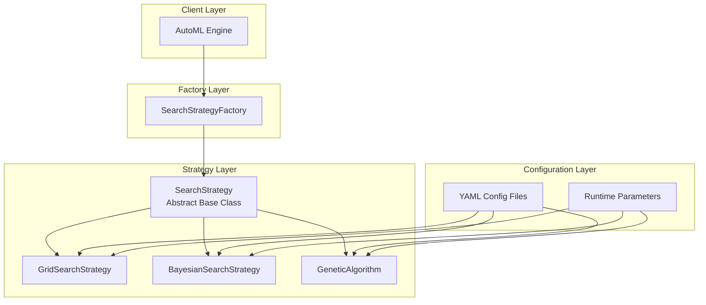

---

## 1. Strategy Pattern

### Mục đích

Cho phép thay đổi thuật toán tìm kiếm siêu tham số tại runtime mà không ảnh hưởng đến code client.


### Cấu trúc UML

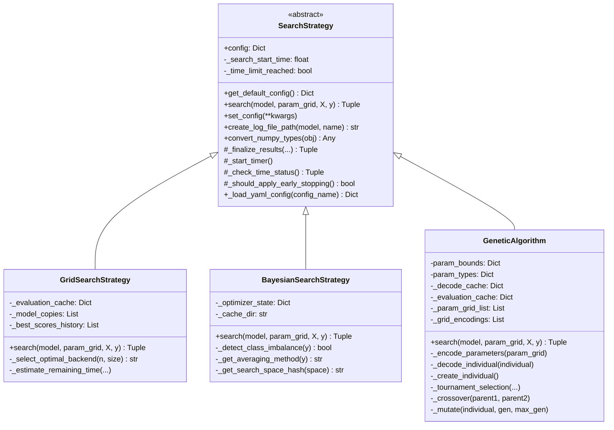

### Luồng hoạt động

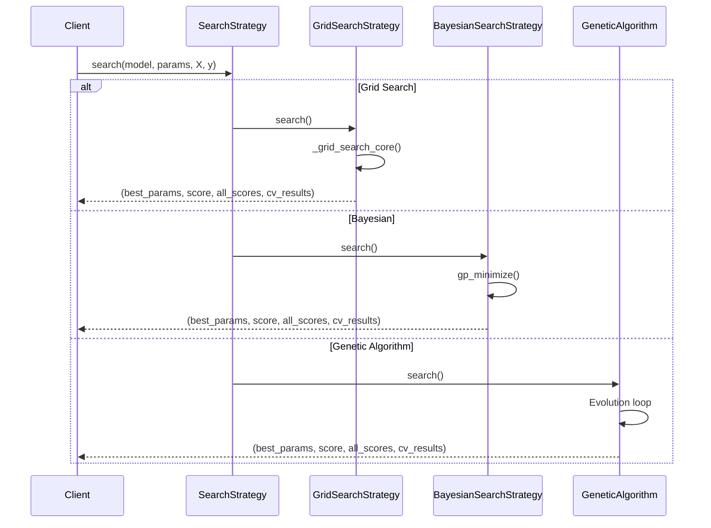

### Triển khai Base Class

```python
from abc import ABC, abstractmethod
from typing import Dict, Any, Tuple, List
from sklearn.base import BaseEstimator
import numpy as np

class SearchStrategy(ABC):
    """Base class cho tất cả search strategies."""

    def __init__(self, **kwargs):
        self.config = self.get_default_config()
        self.config.update(kwargs)
        self._search_start_time = None
        self._time_limit_reached = False

    @staticmethod
    def get_default_config() -> Dict[str, Any]:
        """Trả về cấu hình mặc định, đọc từ file YAML."""
        yaml_config = SearchStrategy._load_yaml_config('base')
        cv_n_splits = yaml_config.get('cv_n_splits', 5)
        cv_shuffle = yaml_config.get('cv_shuffle', True)
        cv_random_state = yaml_config.get('cv_random_state', 42)
        cv = StratifiedKFold(n_splits=cv_n_splits, shuffle=cv_shuffle, 
                             random_state=cv_random_state)
        return {
            'cv': cv,
            'scoring': None,
            'metric_sort': yaml_config.get('metric_sort', 'accuracy'),
            'n_jobs': yaml_config.get('n_jobs', -1),
            'verbose': yaml_config.get('verbose', 0),
            'random_state': yaml_config.get('random_state'),
            'error_score': yaml_config.get('error_score', 'raise'),
            'log_dir': yaml_config.get('log_dir', 'logs'),
            'save_log': yaml_config.get('save_log', False)
        }

    @abstractmethod
    def search(self, model: BaseEstimator, param_grid: List[Dict[str, Any]], 
               X: np.ndarray, y: np.ndarray, **kwargs) -> Tuple:
        """Thực thi thuật toán tìm kiếm - PHẢI được override.
        
        Args:
            model: Mô hình scikit-learn cần tối ưu hóa
            param_grid: List of dicts, mỗi dict chứa các tham số cần tìm kiếm
            X: Dữ liệu features
            y: Dữ liệu target
            
        Returns:
            tuple: (best_params, best_score, best_all_scores, cv_results)
        """
        pass

    def set_config(self, **kwargs):
        """Cập nhật cấu hình runtime."""
        self.config.update(kwargs)
        return self
```

### Normalize Param Grid

Hàm tiện ích `normalize_param_grid` chuẩn hóa đầu vào `param_grid` về định dạng `list-of-dicts`:

```python
def normalize_param_grid(param_grid):
    """
    Chuẩn hóa param_grid về định dạng list-of-dicts.
    
    - None -> [{}]
    - dict -> [dict]
    - list of dicts -> giữ nguyên
    """
```

Điều này cho phép tất cả strategies xử lý thống nhất cả single dict và multiple param grids (tương tự `ParameterGrid` của scikit-learn).

### Lợi ích của Strategy Pattern

| Nguyên tắc SOLID | Áp dụng |
|------------------|---------|
| **S** - Single Responsibility | Mỗi strategy class chỉ chịu trách nhiệm 1 thuật toán |
| **O** - Open/Closed | Thêm strategy mới không cần sửa code hiện có |
| **L** - Liskov Substitution | Tất cả strategies có thể thay thế lẫn nhau |
| **I** - Interface Segregation | Interface `search()` đơn giản, dễ implement |
| **D** - Dependency Inversion | Client phụ thuộc vào abstraction, không phụ thuộc concrete class |

---

## 2. Factory Pattern

### Mục đích

Tạo các instance của search strategy mà không cần biết class cụ thể, giúp decouple client code khỏi concrete implementations.

### Cấu trúc

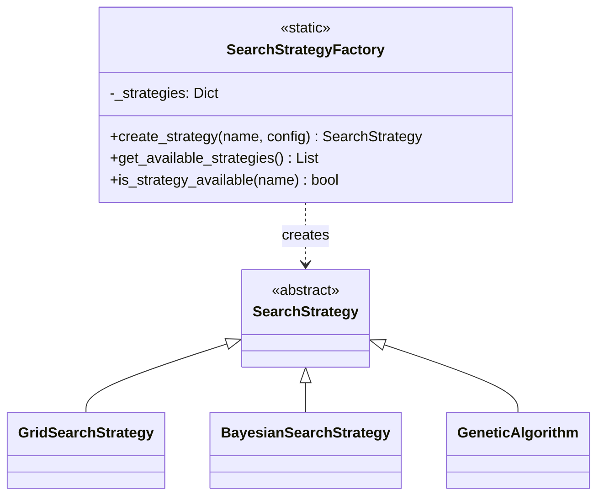


### Luồng hoạt động Factory

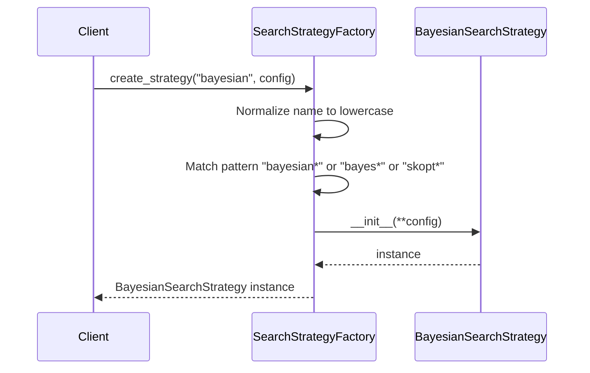

### Triển khai Factory

```python
class SearchStrategyFactory:
    """Factory để tạo search strategy instances."""
    
    _strategies = {
        'grid_search': GridSearchStrategy,
        'genetic_algorithm': GeneticAlgorithm,
        'bayesian_search': BayesianSearchStrategy
    }
    
    @classmethod
    def create_strategy(cls, strategy_name: str, 
                       config: Optional[Dict] = None) -> SearchStrategy:
        strategy_name = strategy_name.lower().strip()
        
        if strategy_name.startswith('grid'):
            strategy_class = GridSearchStrategy
        elif strategy_name.startswith('genetic') or strategy_name.startswith('ga'):
            strategy_class = GeneticAlgorithm
        elif (strategy_name.startswith('bayesian') or 
              strategy_name.startswith('bayes') or 
              strategy_name.startswith('skopt')):
            strategy_class = BayesianSearchStrategy
        else:
            raise ValueError(
                f"Strategy không xác định: '{strategy_name}'. "
                f"Các strategy có sẵn: grid*, genetic*/ga*, bayesian*/bayes*/skopt*"
            )
        
        return strategy_class(**config) if config else strategy_class()
    
    @classmethod
    def get_available_strategies(cls) -> list:
        return ['grid*', 'genetic*/ga*', 'bayesian*/bayes*/skopt*']
```

### Pattern Matching trong Factory

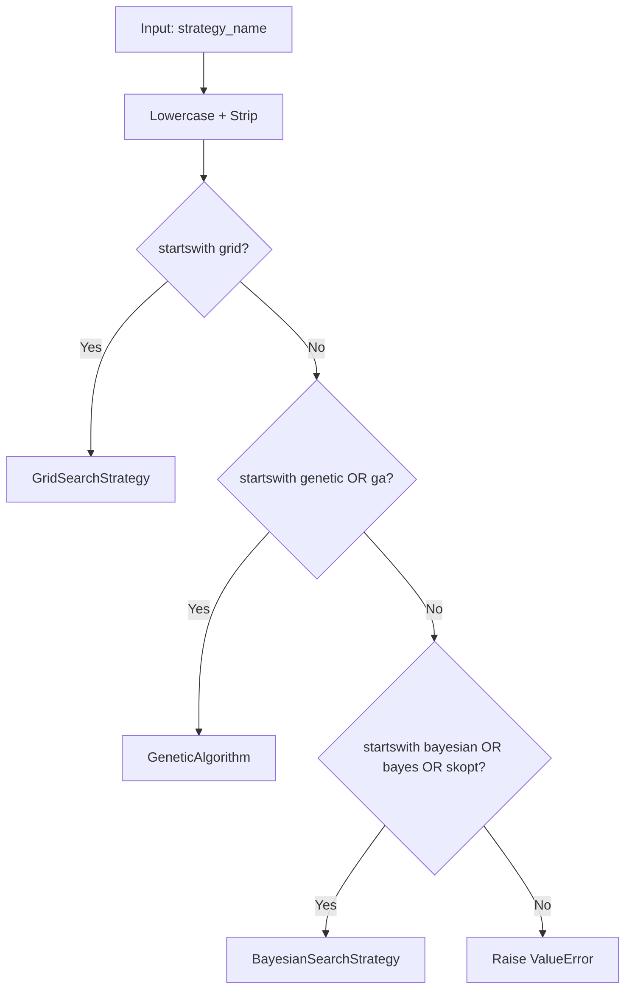

### Cách sử dụng Factory

```python
from automl.search.factory import SearchStrategyFactory

# Tên đầy đủ
strategy = SearchStrategyFactory.create_strategy('grid_search')

# Tên viết tắt
strategy = SearchStrategyFactory.create_strategy('grid')

# Với cấu hình
strategy = SearchStrategyFactory.create_strategy('bayesian', {
    'n_calls': 50,
    'n_initial_points': 10,
    'acq_func': 'EI'
})

# Alias skopt
strategy = SearchStrategyFactory.create_strategy('skopt', {'n_calls': 30})

# Kiểm tra strategy có sẵn
if SearchStrategyFactory.is_strategy_available('genetic'):
    strategy = SearchStrategyFactory.create_strategy('genetic')
```

---

## 3. Template Method Pattern

### Mục đích

Định nghĩa skeleton của thuật toán trong base class, cho phép subclass override các bước cụ thể mà không thay đổi cấu trúc tổng thể.

### Cấu trúc

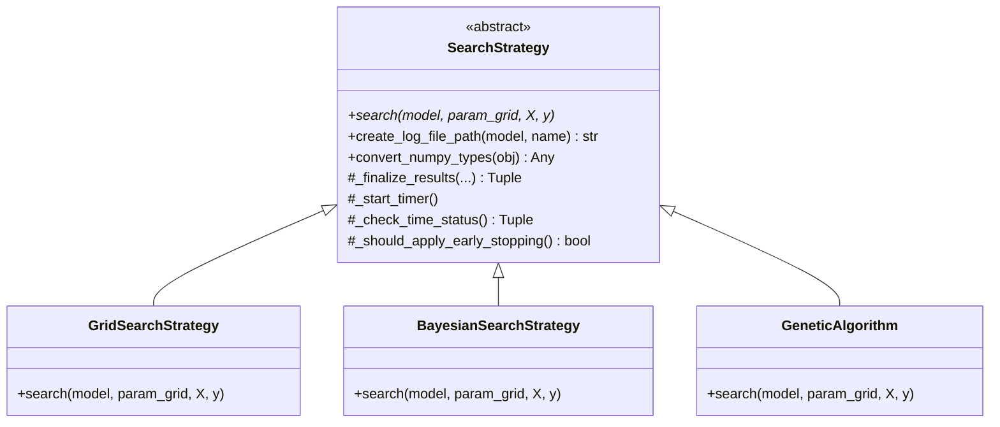

**Template methods trong SearchStrategy:**

- `create_log_file_path()` - Tạo đường dẫn log file chuẩn hóa
- `convert_numpy_types()` - Chuyển đổi numpy sang Python native (đệ quy)
- `_finalize_results()` - Xóa cache + convert numpy types
- `_start_timer()` - Bắt đầu đếm thời gian cho time limit
- `_check_time_status()` - Kiểm tra thời gian còn lại
- `_should_apply_early_stopping()` - Quyết định có áp dụng early stopping không

### Time Limit vs Early Stopping

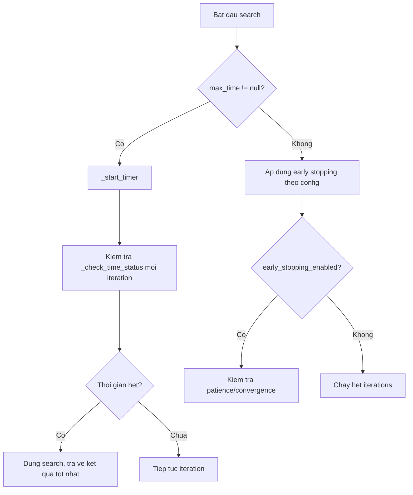

**Quy tắc:** Khi `max_time` được set, early stopping bị vô hiệu hóa (ưu tiên time limit).

### Triển khai Template Methods

```python
class SearchStrategy(ABC):
    
    def _start_timer(self):
        """Bắt đầu đếm thời gian cho search."""
        self._search_start_time = time.time()
        self._time_limit_reached = False

    def _check_time_status(self) -> Tuple[Optional[float], bool]:
        """
        Returns:
            (remaining_time, is_exceeded)
            - remaining_time: None nếu không có time limit
            - is_exceeded: True nếu đã vượt quá
        """
        max_time = self.config.get('max_time')
        if max_time is None:
            return None, False
        elapsed = time.time() - self._search_start_time
        remaining = max(0.0, max_time - elapsed)
        is_exceeded = elapsed >= max_time
        if is_exceeded:
            self._time_limit_reached = True
        return remaining, is_exceeded

    def _should_apply_early_stopping(self) -> bool:
        """Nếu có time limit -> không early stopping. Ngược lại -> theo config."""
        return self.config.get('max_time') is None

    def _finalize_results(self, best_params, best_score, 
                         best_all_scores, cv_results) -> Tuple:
        """Xóa cache + convert numpy types."""
        if hasattr(self, '_decode_cache'):
            self._decode_cache.clear()
        if hasattr(self, '_evaluation_cache'):
            self._evaluation_cache.clear()
        if hasattr(self, '_model_copies'):
            self._model_copies.clear()
        return (
            self.convert_numpy_types(best_params),
            self.convert_numpy_types(best_score),
            self.convert_numpy_types(best_all_scores),
            self.convert_numpy_types(cv_results)
        )
```

---

## 4. Configuration Pattern

### Mục đích

Quản lý cấu hình thuật toán một cách linh hoạt thông qua nhiều nguồn: file YAML, runtime parameters, và default values.

### Cấu trúc phân cấp cấu hình

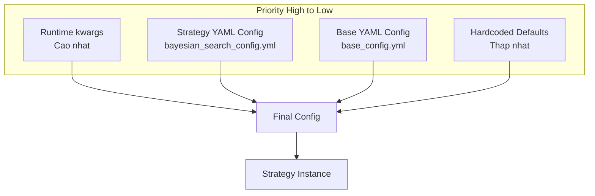

### Các file cấu hình

| File | Mô tả | Phạm vi |
|------|-------|---------|
| `base_config.yml` | Cấu hình cơ sở cho tất cả strategies | Toàn bộ hệ thống |
| `grid_search_config.yml` | Cấu hình riêng cho Grid Search | GridSearchStrategy |
| `bayesian_search_config.yml` | Cấu hình riêng cho Bayesian | BayesianSearchStrategy |
| `genetic_algorithm_config.yml` | Cấu hình riêng cho GA | GeneticAlgorithm |

### Cơ chế Fallback Config

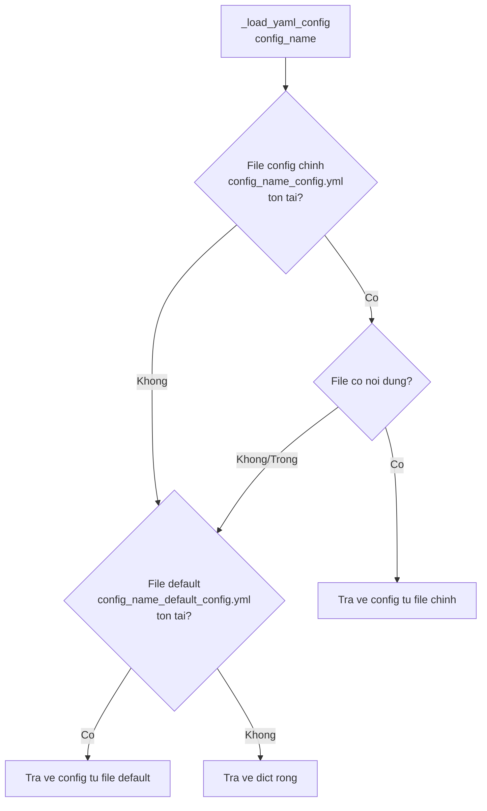

**Quy tắc ưu tiên file config:**

| Thứ tự | File | Mô tả |
|--------|------|-------|
| 1 | `{name}_config.yml` | File config chính (user tùy chỉnh) |
| 2 | `{name}_default_config.yml` | File config mặc định (fallback) |
| 3 | Hardcoded defaults | Giá trị mặc định trong code |

### Cấu hình Base (base_config.yml)

```yaml
# Cross-validation
cv_n_splits: 5
cv_shuffle: true
cv_random_state: 42

# Scoring
metric_sort: 'accuracy'

# Parallel processing
n_jobs: -1

# Logging
verbose: 0
log_dir: 'logs'
save_log: false

# Error handling
error_score: 'raise'

# Random state
random_state: null

# Time limit
max_time: null  # Thời gian tối đa cho search (giây), null = không giới hạn
```

### Override cấu hình tại runtime

```python
# Cấu hình từ YAML: n_calls = 25
# Override tại runtime: n_calls = 100
strategy = SearchStrategyFactory.create_strategy('bayesian', {
    'n_calls': 100,
    'early_stopping_enabled': False
})

# Hoặc sau khi tạo
strategy.set_config(n_calls=150, max_time=300)
```

---

## 5. Caching Pattern

### Mục đích

Tránh đánh giá lặp các tổ hợp tham số đã được đánh giá trước đó, giảm thời gian tính toán.

### Cấu trúc Cache

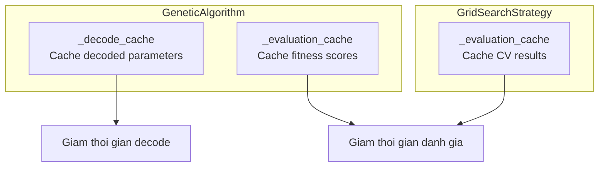

### Luồng hoạt động Cache

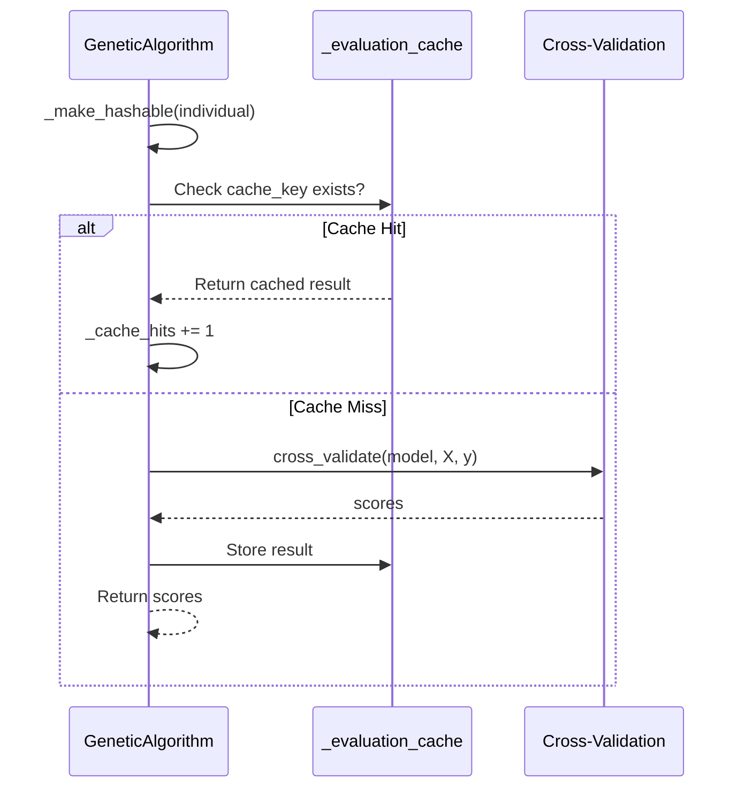

### Quản lý kích thước Cache

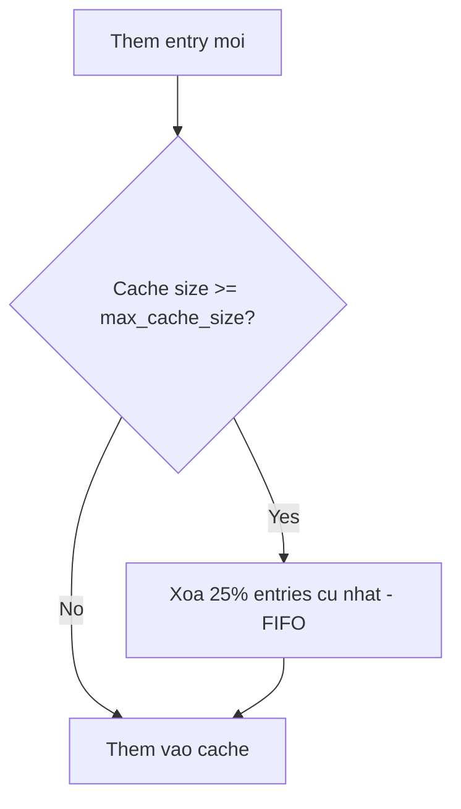

Cấu hình cache trong `genetic_algorithm_config.yml`:

```yaml
use_global_cache: true
max_cache_size: 1000
```

---

## 6. Distributed Task Pattern (V2)

### Mục đích

Phân tán việc huấn luyện nhiều mô hình sang các Worker nodes thông qua hệ thống hàng đợi ưu tiên.

### Cấu trúc

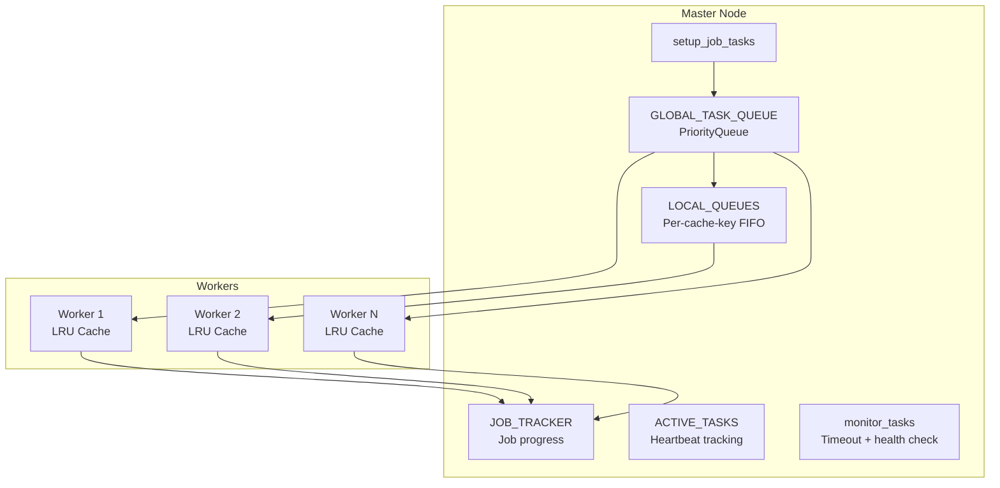

### Luồng phân tán

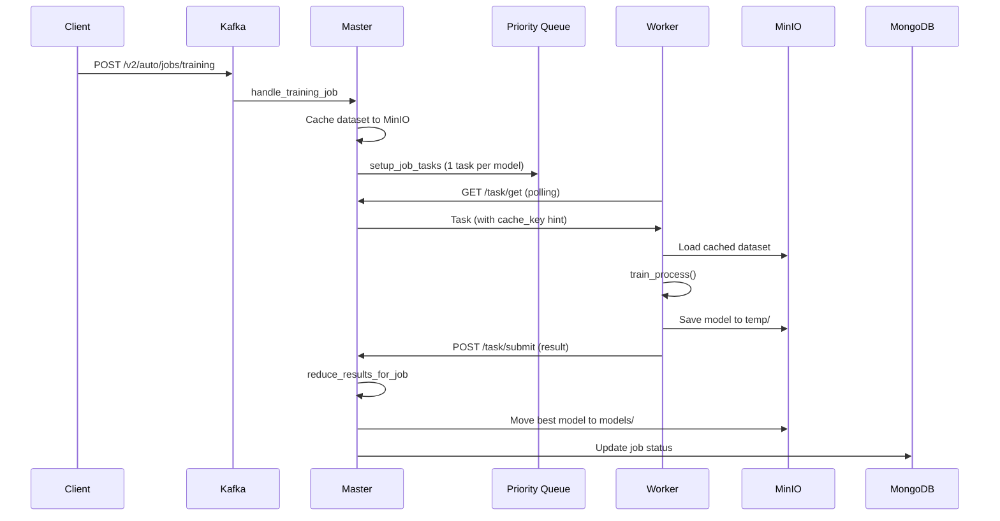

### Cơ chế ưu tiên Task

| Ưu tiên | Mô tả |
|---------|-------|
| 0 | Task bị timeout (được đưa lại vào queue) |
| 1 | Task mới |

Worker nhận task theo logic:
1. Ưu tiên LOCAL_QUEUE (cùng cache_key) → tránh tải lại dataset
2. Fallback GLOBAL_TASK_QUEUE
3. Fallback LOCAL_QUEUE khác (work stealing)

### Worker LRU Cache

Worker duy trì LRU cache tối đa 3 bộ dữ liệu trong memory để tránh tải lại từ MinIO.

---

## Tổng kết Design Patterns

### Bảng tổng kết

| Pattern | Vị trí | Mục đích | Lợi ích |
|---------|--------|----------|---------|
| **Strategy** | `strategy/*.py` | Đổi thuật toán runtime | Linh hoạt, dễ mở rộng |
| **Factory** | `factory/` | Tạo strategy instance | Decouple client code |
| **Template Method** | `base.py` | Tái sử dụng code chung | Giảm duplicate code |
| **Configuration** | `*_config.yml` | Quản lý cấu hình | Linh hoạt, dễ thay đổi |
| **Caching** | Trong mỗi strategy | Tránh tính toán lặp | Tăng hiệu năng |
| **Distributed Task** | `v2/master.py` | Phân tán huấn luyện | Scalability |

### Ví dụ sử dụng tổng hợp

```python
from automl.search.factory import SearchStrategyFactory

# Factory Pattern: Tạo strategy từ tên
strategy = SearchStrategyFactory.create_strategy('genetic', {
    # Configuration Pattern: Override YAML config
    'population_size': 30,
    'use_global_cache': True,  # Caching Pattern
    'max_cache_size': 1000,
    'max_time': 600            # Time limit: 10 phút
})

# Strategy Pattern: Gọi search() - implementation khác nhau
best_params, best_score, all_scores, cv_results = strategy.search(
    model=RandomForestClassifier(),
    param_grid=param_grid,
    X=X_train, y=y_train
)

# Template Method Pattern: _finalize_results() được gọi tự động
# để convert numpy types và clear cache
```
