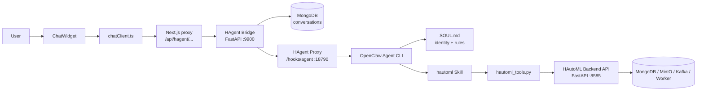
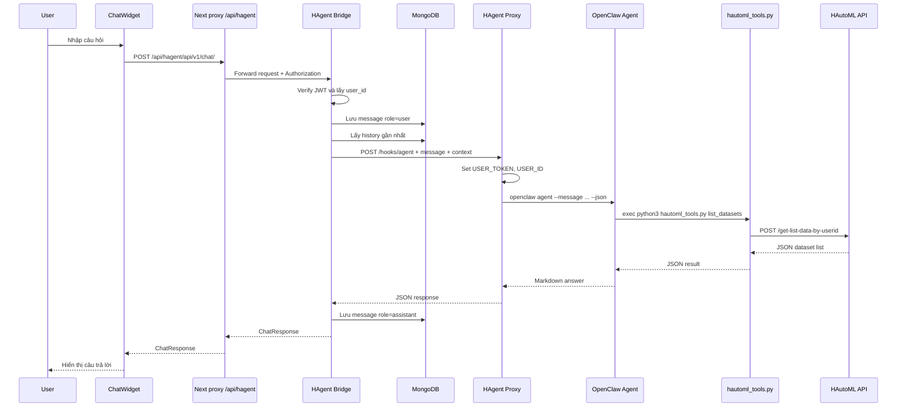
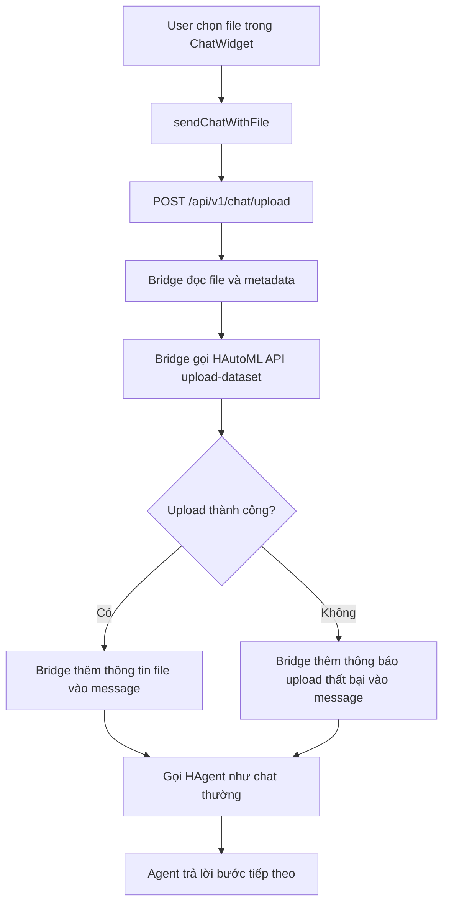
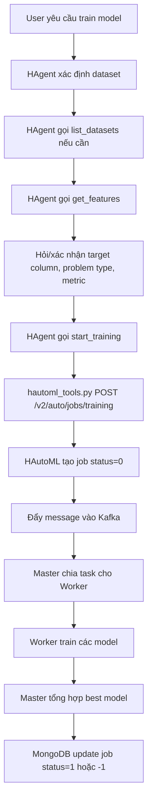
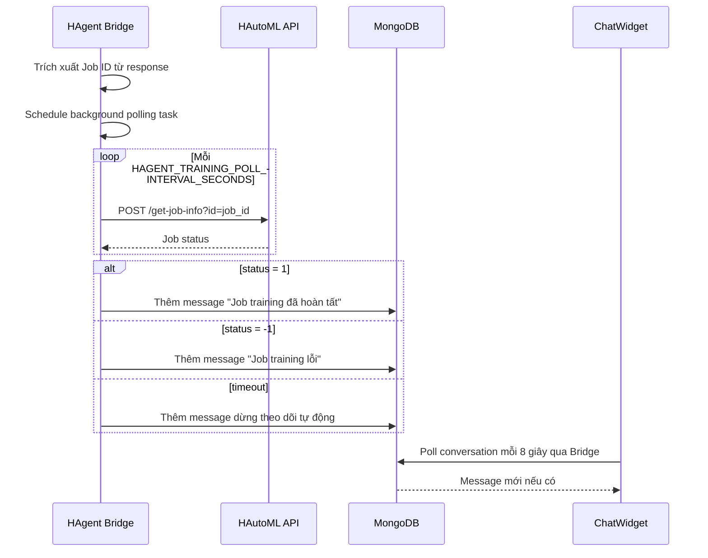
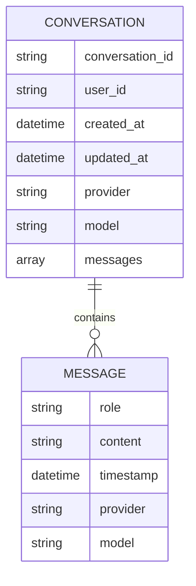
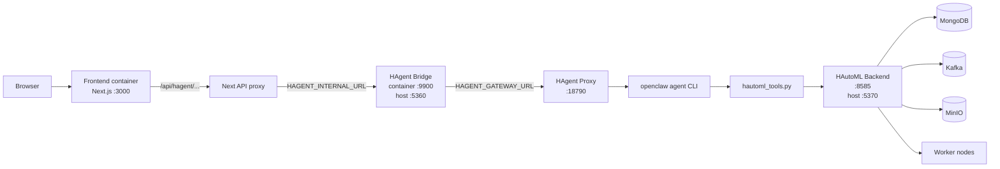

# Giải Thích HAgent Trong HAutoML

Tài liệu này giải thích HAgent theo đúng code hiện có trong repo. Mục tiêu là giúp người mới đọc code nắm được HAgent là gì, nó nằm ở đâu trong hệ thống, và một tin nhắn chat đi qua những lớp nào trước khi trở thành kết quả trên giao diện.

## 1. HAgent là gì?

HAgent là trợ lý AI được nhúng vào ứng dụng HAutoML. Nó không trực tiếp huấn luyện model và cũng không tự xử lý dữ liệu bằng code riêng. Vai trò của HAgent là:

- Nhận yêu cầu từ người dùng qua chat widget.
- Hiểu ý định của người dùng, ví dụ: liệt kê dataset, xem feature, train model, xem job.
- Gọi đúng tool HAutoML đã được khai báo trong skill.
- Trả kết quả rõ ràng bằng tiếng Việt.

Nói ngắn gọn:

```text
Người dùng hỏi bằng ngôn ngữ tự nhiên
        |
        v
HAgent chọn tool phù hợp
        |
        v
Tool gọi REST API của HAutoML
        |
        v
HAgent tóm tắt kết quả cho người dùng
```

Trong code, HAgent được ghép từ nhiều thành phần:

| Thành phần | File / thư mục | Vai trò |
|---|---|---|
| Chat UI | `frontend/src/components/chatWidget/ChatWidget.tsx` | Giao diện chat cho người dùng |
| Chat client | `frontend/src/api/chatClient.ts` | Gọi API chat, upload, health, conversation |
| Next proxy | `frontend/src/app/api/hagent/[...path]/route.ts` | Forward request từ frontend sang HAgent Bridge |
| HAgent Bridge | `backend/hagent/bridge/app.py` | Auth JWT, lưu hội thoại, gọi HAgent Proxy/Gateway |
| Conversation store | `backend/hagent/bridge/conversation.py` | Lưu và đọc lịch sử chat trong MongoDB |
| HAgent Proxy | `backend/hagent/proxy.py` | Biến HTTP request thành lệnh `openclaw agent` |
| Soul | `backend/hagent/SOUL.md` | Định nghĩa identity, giới hạn và cách trả lời của HAgent |
| Skill | `backend/hagent/skills/hautoml/SKILL.md` | Hướng dẫn agent gọi tool HAutoML |
| Tool script | `backend/hagent/skills/hautoml/scripts/hautoml_tools.py` | CLI gọi REST API của HAutoML |
| HAutoML API | `backend/app.py`, `backend/experiment.py` | API dataset, job, training, prediction |

## 2. Kiến Trúc Tổng Quan



Giải thích từng lớp:

1. **ChatWidget** hiện khung chat, nhận input, hiển thị Markdown response.
2. **chatClient.ts** gửi request đến `NEXT_PUBLIC_HAGENT_URL`, mặc định là `/api/hagent`.
3. **Next proxy** đọc `HAGENT_INTERNAL_URL` và forward request sang Bridge.
4. **HAgent Bridge** kiểm tra JWT, lấy `user_id`, lưu message vào MongoDB, lấy lịch sử chat, rồi gọi HAgent endpoint.
5. **HAgent Proxy** nhận `/hooks/agent`, bơm `USER_TOKEN` và `USER_ID` vào environment, chèn nội dung `SOUL.md`, rồi chạy `openclaw agent`.
6. **OpenClaw Agent** đọc instruction, chọn skill `hautoml`, và gọi tool `exec`.
7. **hautoml_tools.py** gọi REST API của HAutoML backend.
8. Kết quả đi ngược lại về UI.

## 3. Luồng Chat Thường

Ví dụ người dùng hỏi: "Liệt kê dataset của tôi".



Chi tiết quan trọng trong code:

- Frontend gọi `sendChatMessage()` trong `chatClient.ts`.
- Bridge endpoint chính là `POST /api/v1/chat/` trong `backend/hagent/bridge/app.py`.
- Bridge gửi payload có dạng:

```json
{
  "message": "nội dung người dùng",
  "context": {
    "user_token": "...",
    "user_id": "...",
    "hautoml_url": "..."
  },
  "history": []
}
```

- Proxy không trả trực tiếp output raw của CLI. Nó parse JSON output của `openclaw agent`, lấy text trong `payloads`, clean bot narration, rồi trả về:

```json
{
  "response": "nội dung trả lời",
  "sources": [],
  "suggestions": [],
  "provider": "hagent",
  "model": "agent"
}
```

## 4. Luồng Upload File Qua Chat

Người dùng có thể đính kèm file CSV, XLS hoặc XLSX trong ChatWidget.



Trong `backend/hagent/bridge/app.py`, endpoint upload:

- Nhận `message`, `file`, `conversation_id`.
- Gọi HAutoML backend qua `/upload-dataset?user_id=...`.
- Nếu upload thành công, Bridge ghép thêm dòng thông tin file vào message.
- Sau đó Bridge vẫn gọi HAgent Gateway/Proxy bằng `_call_hagent_gateway()` như chat bình thường.

Điều này có nghĩa là upload file và hỏi tiếp đều nằm trong cùng conversation.

## 5. Luồng Training Model

Training là luồng phức tạp hơn vì job có thể chạy lâu. HAgent không tự train model. Nó chỉ thu thập tham số, rồi gọi tool `start_training`.



Lệnh tool tương ứng trong `hautoml_tools.py` là `start_training`. Script sẽ tạo body có dạng:

```json
{
  "id_data": "dataset_id",
  "id_user": "user_id",
  "config": {
    "choose": "grid_search",
    "metric_sort": "accuracy",
    "list_feature": ["feature_1", "feature_2"],
    "target": "target_column",
    "problem_type": "classification",
    "max_time": 900
  }
}
```

Sau đó nó gọi:

```text
POST /v2/auto/jobs/training
```

### Bridge tự theo dõi kết quả training

HAgent Bridge có logic riêng để bắt `Job ID` trong câu trả lời của agent. Nếu tìm thấy job id, Bridge tạo background task để poll kết quả.



Frontend trong `ChatWidget.tsx` cũng có polling conversation mỗi 8 giây. Nhờ vậy, khi training hoàn tất, người dùng có thể thấy tin nhắn kết quả dù agent không còn đang trả lời trực tiếp.

## 6. Lưu Hội Thoại Trong MongoDB

HAgent Bridge lưu hội thoại trong MongoDB qua `backend/hagent/bridge/conversation.py`.



Mỗi conversation gồm:

- `conversation_id`: ID của hội thoại.
- `user_id`: ID người dùng, dùng để phân quyền truy cập lịch sử.
- `messages`: danh sách tin nhắn.
- `created_at`, `updated_at`: thời gian tạo/cập nhật.
- `provider`, `model`: thông tin provider/model đã trả lời.

Bridge tạo index:

- Unique index theo `user_id + conversation_id`.
- TTL index theo `updated_at`, hết hạn theo `conversation_ttl_hours` trong `hagent.yaml`.

Lưu ý: repo còn có `backend/hagent/chat_router.py` và `backend/hagent/chat_store.py`, đây là router chat được mount trực tiếp vào backend chính. Tuy nhiên với cấu hình frontend Docker hiện tại, luồng chính của UI đi qua HAgent Bridge service riêng.

## 7. Cấu Hình Và Deploy

### hagent.yaml

File `backend/hagent/hagent.yaml` là cấu hình trung tâm cho Bridge/Gateway:

| Nhóm | Ý nghĩa |
|---|---|
| `gateway` | Host/port mặc định của HAgent gateway |
| `bridge` | Host/port và CORS của Bridge |
| `hautoml` | Base URL của HAutoML backend |
| `mongodb` | Kết nối MongoDB và TTL conversation |
| `auth` | JWT secret và algorithm |
| `hooks` | Webhook path và token |
| `skills` | Thư mục skill |
| `memory` | Cấu hình memory của agent |
| `logging` | Cấu hình log |

### Biến môi trường quan trọng

Tài liệu này chỉ liệt kê tên biến, không ghi giá trị secret.

| Biến | Nội dung |
|---|---|
| `HAGENT_CONFIG` | Đường dẫn file `hagent.yaml` trong container |
| `HAGENT_GATEWAY_URL` | URL Bridge dùng để gọi HAgent Proxy/Gateway |
| `HAGENT_HOOKS_TOKEN` | Bearer token cho webhook `/hooks/agent` |
| `HAUTOML_BASE_URL` | URL backend HAutoML mà tool script sẽ gọi |
| `SECRET_KEY` | Secret để verify JWT |
| `ALGORITHM` | Thuật toán JWT, ví dụ `HS256` |
| `MONGODB_CONNECT` | Địa chỉ MongoDB |
| `MONGODB_DB_NAME` | Tên database MongoDB |
| `NEXT_PUBLIC_HAGENT_URL` | Base URL frontend dùng để gọi HAgent |
| `HAGENT_INTERNAL_URL` | URL nội bộ để Next proxy forward sang Bridge |

### Sơ đồ container



Trong `backend/docker-compose.yaml`:

- Service `hagent_bridge` expose host port mặc định `5360` vào container port `9900`.
- `hagent_bridge` mount `backend/hagent/hagent.yaml` vào container và set `HAGENT_CONFIG`.
- `hagent_bridge` set `HAUTOML_BASE_URL` để trỏ đến service `toolkit`.
- `hagent_bridge` set `HAGENT_GATEWAY_URL` để trỏ đến HAgent Proxy.
- Service `toolkit` chạy backend HAutoML và cũng start `hagent/proxy.py`.
- Service `openclaw_gateway` cũng copy skill/tool vào OpenClaw workspace và chạy gateway/proxy cho môi trường OpenClaw.

Trong `frontend/docker-compose.yaml`:

- `NEXT_PUBLIC_HAGENT_URL=/api/hagent`.
- `HAGENT_INTERNAL_URL` trỏ đến Bridge host port.

## 8. Vai Trò Của SOUL.md, SKILL.md Và Tools

### SOUL.md

`SOUL.md` định nghĩa hành vi bắt buộc của HAgent:

- Chỉ dùng tool `exec`.
- Không viết code Python/JavaScript để tự xử lý dữ liệu.
- Không tạo, sửa, xóa file workspace.
- Không cài thư viện.
- Không hỏi người dùng `USER_TOKEN`, `USER_ID` hay credential.
- Nếu tool không trả dữ liệu thì phải nói thật, không bịa kết quả.
- Trả lời bằng tiếng Việt nếu người dùng không đổi ngôn ngữ.

### SKILL.md

`backend/hagent/skills/hautoml/SKILL.md` nói cho OpenClaw agent biết khi nào dùng skill HAutoML và phải gọi lệnh nào.

Ví dụ để liệt kê dataset, agent phải gọi tool `exec` với command:

```bash
python3 /home/node/.openclaw/skills/hautoml/scripts/hautoml_tools.py list_datasets \
  --user-id "$USER_ID" --token "$USER_TOKEN"
```

### hautoml_tools.py

`hautoml_tools.py` là CLI wrapper. Nó không train model trực tiếp. Nó chỉ:

- Nhận subcommand từ agent.
- Lấy token/user id từ argument, environment hoặc fallback file.
- Tạo HTTP request đến HAutoML backend.
- In JSON kết quả ra stdout để agent đọc.

Một số subcommand quan trọng:

| Subcommand | API HAutoML |
|---|---|
| `health` | `GET /home` |
| `list_datasets` | `POST /get-list-data-by-userid` |
| `get_dataset_info` | `GET /get-data-info` |
| `get_features` | `GET /v2/auto/features` |
| `preview_data` | `GET /v2/auto/data` |
| `get_available_models` | `GET /api/v1/available-models/{problem_type}` |
| `get_metrics` | `GET /v2/auto/metrics` |
| `start_training` | `POST /v2/auto/jobs/training` |
| `list_jobs` | `POST /get-list-job-by-userId` |
| `get_job_info` | `POST /get-job-info` |
| `batch_predict` | `POST /v2/auto/{job_id}/predictions` |
| `delete_dataset` | `DELETE /delete-dataset/{dataset_id}` |

## 9. Các Endpoint Chat Chính

| Method | Endpoint | Vai trò |
|---|---|---|
| `POST` | `/api/v1/chat/` | Gửi tin nhắn chat |
| `POST` | `/api/v1/chat/upload` | Gửi tin nhắn kèm file |
| `GET` | `/api/v1/chat/health` | Kiểm tra Bridge, Gateway/Proxy và HAutoML backend |
| `GET` | `/api/v1/chat/suggestions` | Lấy gợi ý ban đầu |
| `GET` | `/api/v1/chat/conversations` | Lấy danh sách hội thoại gần đây |
| `GET` | `/api/v1/chat/conversation/{conversation_id}` | Lấy toàn bộ message của một hội thoại |
| `DELETE` | `/api/v1/chat/conversation/{conversation_id}` | Xóa hội thoại |
| `GET` | `/api/v1/chat/providers` | Liệt kê provider khả dụng, hiện chỉ có HAgent |

## 10. Tóm Tắt Dễ Nhớ

```text
HAgent = Chat UI + Bridge + Proxy + OpenClaw Agent + HAutoML Skill + Tool script
```

Những điểm cần nhớ:

- HAgent không thay thế HAutoML backend. Nó chỉ là lớp trợ lý điều phối.
- HAgent Bridge là lớp API chat quan trọng nhất: auth, history, upload, health, polling training result.
- HAgent Proxy là lớp adapter: HTTP request -> `openclaw agent`.
- `SOUL.md` và `SKILL.md` kiểm soát hành vi của agent.
- `hautoml_tools.py` là nơi agent thật sự chạm vào HAutoML API.
- MongoDB lưu lịch sử hội thoại và kết quả assistant.
- Training job chạy bất đồng bộ qua backend HAutoML, Kafka, Master và Worker; Bridge chỉ poll kết quả để thông báo lại trong chat.
