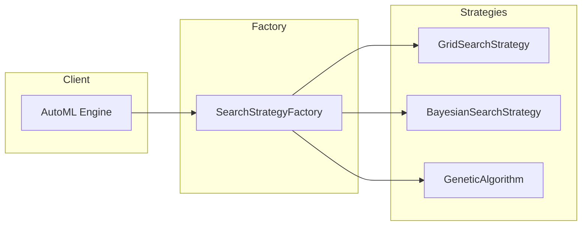
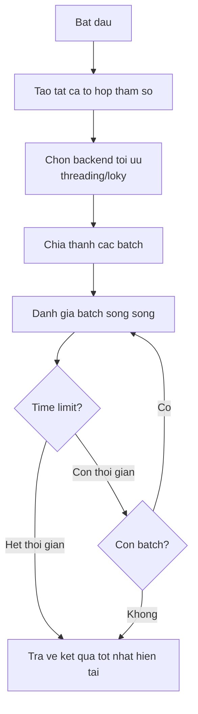
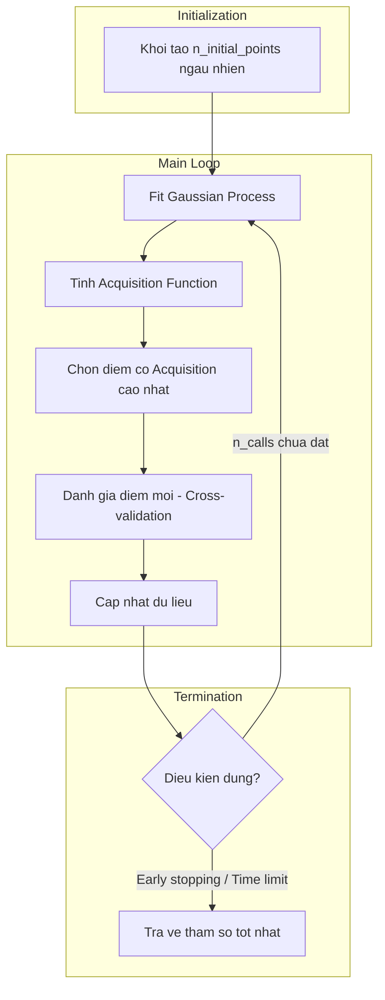
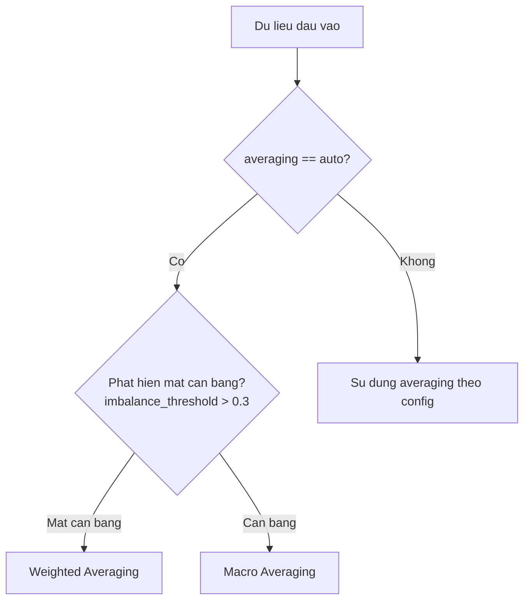
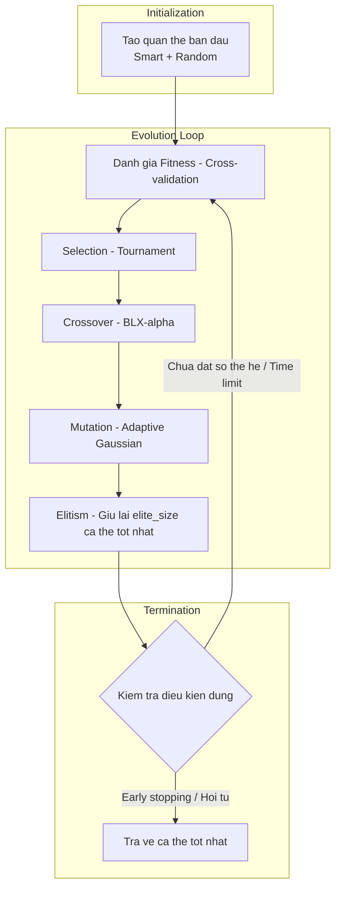
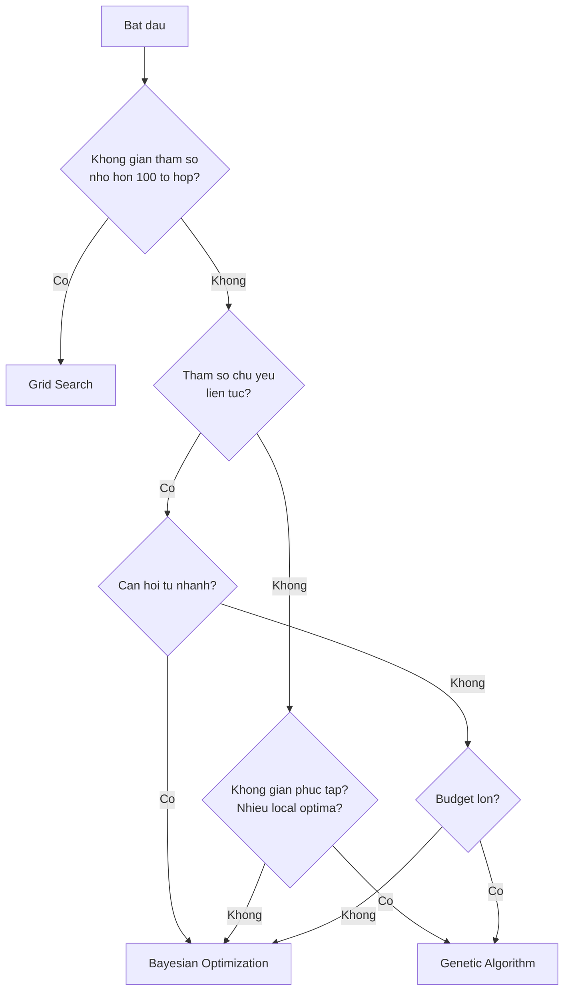

# Thuật toán tìm kiếm siêu tham số

HAutoML hỗ trợ 3 thuật toán tìm kiếm siêu tham số chính, áp dụng cho cả **classification** và **regression**. Tài liệu này mô tả chi tiết nguyên lý hoạt động, cấu hình và cách sử dụng từng thuật toán.

## Tổng quan kiến trúc



### Param Grid Format

Tất cả strategies chấp nhận `param_grid` ở dạng **list-of-dicts** (được chuẩn hóa bởi `normalize_param_grid`):

```python
# Single dict (tự động wrap thành list)
param_grid = {'n_estimators': [50, 100], 'max_depth': [5, 10]}

# List of dicts (multiple search spaces)
param_grid = [
    {'kernel': ['rbf'], 'C': [1, 10]},
    {'kernel': ['linear'], 'C': [1, 10, 100]}
]
```

---

## 1. Grid Search

### Nguyên lý hoạt động

Grid Search là phương pháp tìm kiếm **vét cạn** (exhaustive search), duyệt qua tất cả các tổ hợp tham số có thể trong không gian tìm kiếm đã định nghĩa.



### Đặc điểm

| Ưu điểm | Nhược điểm |
|---------|------------|
| ✅ Đảm bảo tìm được tối ưu trong grid | ❌ Tốn thời gian với không gian lớn |
| ✅ Dễ hiểu và triển khai | ❌ Không hiệu quả với tham số liên tục |
| ✅ Song song hóa dễ dàng | ❌ Độ phức tạp O(n^k) |
| ✅ Kết quả có thể tái tạo | ❌ Không thích ứng với kết quả trung gian |

### Tối ưu hóa trong HAutoML

- **Auto Backend Selection**: Tự động chọn `threading` (nhẹ) hoặc `loky` (multiprocessing) dựa trên workload
- **Result Caching**: Cache kết quả đã đánh giá
- **Batch Processing**: Xử lý theo batch để tiết kiệm memory
- **Time Estimate**: Ước tính thời gian còn lại

### Cấu hình (grid_search_config.yml)

```yaml
# Dispatch
pre_dispatch: '2*n_jobs'

# Training
return_train_score: false

# Song song
parallel_evaluation: true
batch_size: 10
auto_select_backend: true    # Tự động chọn threading/loky

# Cache
cache_evaluations: true

# Early stopping
early_stopping_enabled: false
early_stopping_score: null
early_stopping_n_best: null
early_stopping_no_improve: null

# Progress tracking
show_progress: true
show_time_estimate: true
```

### Code sử dụng

```python
from automl.search.factory import SearchStrategyFactory
from sklearn.ensemble import RandomForestClassifier

strategy = SearchStrategyFactory.create_strategy('grid', {
    'cv': 5,
    'n_jobs': -1,
    'parallel_evaluation': True,
    'max_time': 300  # Giới hạn 5 phút
})

param_grid = {
    'n_estimators': [50, 100, 200],
    'max_depth': [5, 10, 15, None],
    'min_samples_split': [2, 5, 10]
}

best_params, best_score, all_scores, cv_results = strategy.search(
    model=RandomForestClassifier(),
    param_grid=param_grid,
    X=X_train, y=y_train
)
```

---

## 2. Bayesian Optimization

### Nguyên lý hoạt động

Bayesian Optimization sử dụng **Gaussian Process (GP)** để xây dựng mô hình xác suất của hàm mục tiêu, sau đó dùng **Acquisition Function** để quyết định điểm tiếp theo cần đánh giá.



### Acquisition Functions

| Function | Đặc điểm |
|----------|----------|
| **EI** (Expected Improvement) | Cân bằng exploration/exploitation, mặc định |
| **PI** (Probability of Improvement) | Hội tụ nhanh, dễ kẹt local |
| **LCB** (Lower Confidence Bound) | Khám phá nhiều, chậm hội tụ |
| **gp_hedge** | Tự động chọn giữa EI, PI, LCB |

### Xử lý mất cân bằng lớp



### Cấu hình (bayesian_search_config.yml)

```yaml
# Optimization
n_calls: 25
n_initial_points: 5

# Acquisition Function
acq_func: "EI"
acq_optimizer: "sampling"

# Averaging
averaging: "auto"          # auto, macro, weighted
optimize_for: "auto"
imbalance_threshold: 0.3

# Early Stopping
early_stopping_enabled: true
early_stopping_patience: 5
convergence_threshold: 0.001

# Warm Start
warm_start_enabled: false
save_optimizer_state: true
```

### Code sử dụng

```python
from skopt.space import Real, Integer, Categorical
from automl.search.factory import SearchStrategyFactory

param_space = {
    'n_estimators': Integer(50, 300, name='n_estimators'),
    'max_depth': Integer(3, 20, name='max_depth'),
    'learning_rate': Real(0.001, 0.3, prior='log-uniform', name='learning_rate'),
}

strategy = SearchStrategyFactory.create_strategy('bayesian', {
    'n_calls': 50,
    'n_initial_points': 10,
    'acq_func': 'EI',
    'early_stopping_enabled': True
})

best_params, best_score, all_scores, cv_results = strategy.search(
    model=XGBClassifier(),
    param_grid=param_space,
    X=X_train, y=y_train
)
```

---

## 3. Genetic Algorithm

### Nguyên lý hoạt động

Thuật toán di truyền (GA) mô phỏng quá trình tiến hóa tự nhiên: **Selection**, **Crossover**, **Mutation**.



### Chi tiết các toán tử di truyền

#### Tournament Selection

Chọn ngẫu nhiên `tournament_size` cá thể, lấy cá thể có fitness cao nhất.

#### BLX-α Crossover

```
lower = min(p1, p2) - α × |p1 - p2|
upper = max(p1, p2) + α × |p1 - p2|
child = random.uniform(lower, upper)
```

Adaptive: Khi diversity < 0.1, crossover_rate tự động tăng 20%.

#### Adaptive Gaussian Mutation

```
adaptive_rate = base_rate × (1 - gen/max_gen)
```

Đầu quá trình: đột biến mạnh (khám phá). Cuối quá trình: đột biến yếu (tinh chỉnh).

#### List-of-Dicts Param Grid

GA hỗ trợ `list-of-dicts` format. Mỗi grid có encoding riêng:

```python
param_grid = [
    {'kernel': ['rbf'], 'C': [1, 10], 'gamma': (0.001, 1.0)},
    {'kernel': ['linear'], 'C': [1, 10, 100]}
]
```

- `list` → categorical encoding
- `tuple(min, max)` → continuous/integer encoding

### Cấu hình (genetic_algorithm_config.yml)

```yaml
# Quần thể
population_size: 10
min_population: 4
max_population: 12

# Thế hệ
generation: 5
early_stopping_patience: 2
early_stopping_enabled: true

# Toán tử di truyền
mutation_rate: 0.2
crossover_rate: 0.9
adaptive_tournament_size: true
elite_size: 2
tournament_size: 2
alpha: 0.5                    # Hệ số BLX-α

# Hiệu suất
parallel_evaluation: true
use_global_cache: true
max_cache_size: 1000
adaptive_population: true
convergence_threshold: 0.002

# Tốc độ
fast_mode: true
ultra_fast_mode: true
skip_diversity_check: false
simple_crossover: true
fast_diversity: true          # O(n) diversity thay vì O(n²)

# Khởi tạo
n_initial_random: 3
```

### Code sử dụng

```python
from automl.search.factory import SearchStrategyFactory
from sklearn.ensemble import RandomForestClassifier

strategy = SearchStrategyFactory.create_strategy('genetic', {
    'population_size': 20,
    'generation': 15,
    'elite_size': 2,
    'crossover_rate': 0.8,
    'mutation_rate': 0.1,
    'cv': 5,
    'n_jobs': -1
})

param_grid = {
    'n_estimators': [50, 100, 150, 200],     # Categorical
    'max_depth': (3, 20),                     # Integer range
    'min_samples_split': [2, 5, 10, 20],     # Categorical
    'min_samples_leaf': (1, 10),              # Integer range
    'max_features': ['sqrt', 'log2', None]   # Categorical
}

best_params, best_score, all_scores, cv_results = strategy.search(
    model=RandomForestClassifier(),
    param_grid=param_grid,
    X=X_train, y=y_train
)
```

---

## Classification vs Regression

### Classification

Engine sử dụng `StratifiedKFold` và tạo scorers dựa trên `metric_sort`:

| metric_sort | Scorers được tạo |
|------------|------------------|
| `'accuracy'` | `accuracy` |
| `'f1'` | `f1_macro`, `f1_weighted` |
| `'f1_macro'` | Chỉ `f1_macro` |
| `'f1_weighted'` | Chỉ `f1_weighted` |
| `'precision'` | `precision_macro`, `precision_weighted` |

**Quy tắc:**
- Không có suffix → tạo cả `_macro` và `_weighted`, dùng `_macro` làm mặc định
- Có suffix `_macro` hoặc `_weighted` → chỉ tạo scorer tương ứng

### Regression

Engine sử dụng `KFold` và scoring dict cố định:

```python
scoring = {
    "mse": make_scorer(mse_score, greater_is_better=False),
    "mae": make_scorer(mae_score, greater_is_better=False),
    "mape": make_scorer(mape_score, greater_is_better=False),
    "r2": make_scorer(r2_score, greater_is_better=True),
}
```

Metrics MSE/MAE/MAPE: càng nhỏ càng tốt. R2: càng lớn càng tốt.

### Classification Metrics Output

Tất cả strategies trả về classification metrics chi tiết trong `all_scores`:

```python
all_scores = {
    'accuracy': 0.95,
    'macro': {
        'precision': 0.94,
        'recall': 0.93,
        'f1': 0.935
    },
    'weighted': {
        'precision': 0.95,
        'recall': 0.95,
        'f1': 0.95
    },
    'classification_report': { ... }
}
```

---

## So sánh chi tiết các thuật toán

### Bảng so sánh

| Tiêu chí | Grid Search | Bayesian | Genetic Algorithm |
|----------|-------------|----------|-------------------|
| **Độ phức tạp thời gian** | O(n^k) | O(m) | O(g × p) |
| **Độ phức tạp không gian** | O(1) | O(m²) | O(p) |
| **Tham số liên tục** | ❌ Kém | ✅ Xuất sắc | ✅ Tốt |
| **Tham số rời rạc** | ✅ Tốt | ✅ Tốt | ✅ Tốt |
| **Song song hóa** | ✅ Hoàn toàn | ⚠️ Hạn chế | ✅ Theo thế hệ |
| **Khám phá toàn cục** | ✅ Đầy đủ | ⚠️ Phụ thuộc prior | ✅ Tốt |
| **Hội tụ** | N/A | ✅ Nhanh | ⚠️ Trung bình |
| **Thoát local optima** | N/A | ⚠️ Khó | ✅ Tốt |
| **Time limit** | ✅ | ✅ | ✅ |
| **Early stopping** | ✅ | ✅ | ✅ |

**Ký hiệu:** n = số giá trị/tham số, k = số tham số, m = n_calls, g = số thế hệ, p = population_size

### Hướng dẫn chọn thuật toán



| Tình huống | Thuật toán khuyến nghị |
|------------|------------------------|
| Không gian nhỏ, cần đảm bảo | Grid Search |
| Tham số liên tục, budget hạn chế | Bayesian Optimization |
| Không gian phức tạp, nhiều local optima | Genetic Algorithm |
| Cần kết quả nhanh | Bayesian với early stopping |
| Giới hạn thời gian cứng | Bất kỳ + `max_time` |

---

## Ví dụ hoàn chỉnh

```python
from automl.search.factory import SearchStrategyFactory
from sklearn.ensemble import GradientBoostingClassifier
from sklearn.datasets import load_iris
from sklearn.model_selection import train_test_split

# Load dữ liệu
X, y = load_iris(return_X_y=True)
X_train, X_test, y_train, y_test = train_test_split(X, y, test_size=0.2)

# Định nghĩa không gian tham số
param_grid = {
    'n_estimators': [50, 100, 200],
    'max_depth': [3, 5, 7],
    'learning_rate': [0.01, 0.1, 0.2],
    'subsample': [0.8, 0.9, 1.0]
}

# So sánh 3 thuật toán
strategies = ['grid', 'bayesian', 'genetic']
results = {}

for name in strategies:
    strategy = SearchStrategyFactory.create_strategy(name, {
        'cv': 5,
        'scoring': {'accuracy': 'accuracy', 'f1': 'f1_macro'},
        'metric_sort': 'f1',
        'max_time': 120  # Giới hạn 2 phút mỗi strategy
    })
    
    best_params, best_score, all_scores, _ = strategy.search(
        model=GradientBoostingClassifier(),
        param_grid=param_grid,
        X=X_train, y=y_train
    )
    
    results[name] = {
        'params': best_params,
        'score': best_score,
        'all_scores': all_scores
    }
    
    print(f"\n{name.upper()}:")
    print(f"  Best F1: {best_score:.4f}")
    print(f"  Params: {best_params}")
```
