# Sơ Đồ Luồng Hệ Thống HAutoML

## 1. Luồng Huấn Luyện Đồng Bộ (Synchronous Training)

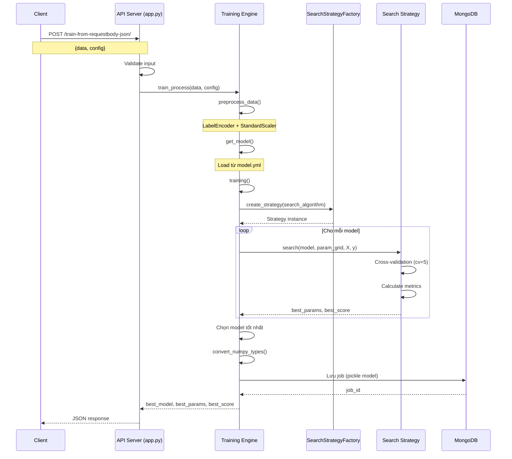
```mermaid
sequenceDiagram
    participant Client
    participant API as API Server (app.py)
    participant Engine as Training Engine
    participant Factory as SearchStrategyFactory
    participant Strategy as Search Strategy
    participant MongoDB
    
    Client->>API: POST /train-from-requestbody-json/
    Note over Client,API: {data, config}
    
    API->>API: Validate input
    API->>Engine: train_process(data, config)
    
    Engine->>Engine: preprocess_data()
    Note over Engine: LabelEncoder + StandardScaler
    
    Engine->>Engine: get_model()
    Note over Engine: Load từ model.yml
    
    Engine->>Engine: training()
    
    Engine->>Factory: create_strategy(search_algorithm)
    Factory-->>Engine: Strategy instance
    
    loop Cho mỗi model
        Engine->>Strategy: search(model, param_grid, X, y)
        Strategy->>Strategy: Cross-validation (cv=5)
        Strategy->>Strategy: Calculate metrics
        Strategy-->>Engine: best_params, best_score
    end
    
    Engine->>Engine: Chọn model tốt nhất
    Engine->>Engine: convert_numpy_types()
    
    Engine->>MongoDB: Lưu job (pickle model)
    MongoDB-->>Engine: job_id
    
    Engine-->>API: best_model, best_params, best_score
    API-->>Client: JSON response
```

## 2. Luồng Huấn Luyện Bất Đồng Bộ (Asynchronous Training)

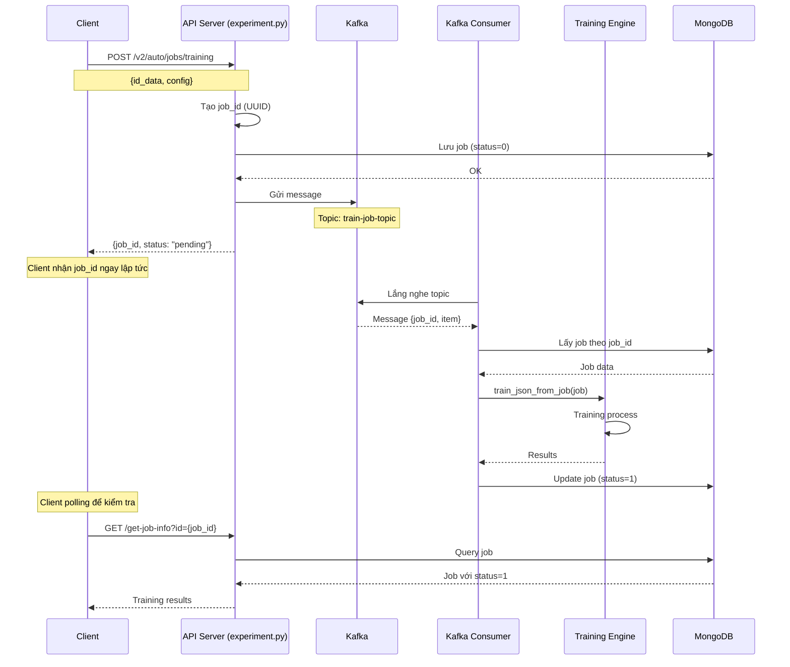
```mermaid
sequenceDiagram
    participant Client
    participant API as API Server (experiment.py)
    participant Kafka
    participant Consumer as Kafka Consumer
    participant Engine as Training Engine
    participant MongoDB
    
    Client->>API: POST /v2/auto/jobs/training
    Note over Client,API: {id_data, config}
    
    API->>API: Tạo job_id (UUID)
    API->>MongoDB: Lưu job (status=0)
    MongoDB-->>API: OK
    
    API->>Kafka: Gửi message
    Note over Kafka: Topic: train-job-topic
    
    API-->>Client: {job_id, status: "pending"}
    Note over Client: Client nhận job_id ngay lập tức
    
    Consumer->>Kafka: Lắng nghe topic
    Kafka-->>Consumer: Message {job_id, item}
    
    Consumer->>MongoDB: Lấy job theo job_id
    MongoDB-->>Consumer: Job data
    
    Consumer->>Engine: train_json_from_job(job)
    Engine->>Engine: Training process
    Engine-->>Consumer: Results
    
    Consumer->>MongoDB: Update job (status=1)
    
    Note over Client: Client polling để kiểm tra
    Client->>API: GET /get-job-info?id={job_id}
    API->>MongoDB: Query job
    MongoDB-->>API: Job với status=1
    API-->>Client: Training results
```

## 3. Luồng Huấn Luyện Phân Tán (Distributed Training)

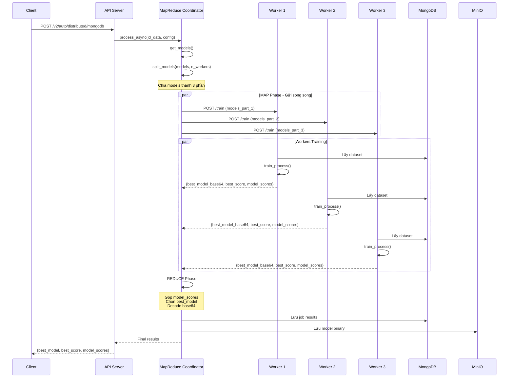
```mermaid
sequenceDiagram
    participant Client
    participant API as API Server
    participant Coordinator as MapReduce Coordinator
    participant W1 as Worker 1
    participant W2 as Worker 2
    participant W3 as Worker 3
    participant MongoDB
    participant MinIO
    
    Client->>API: POST /v2/auto/distributed/mongodb
    API->>Coordinator: process_async(id_data, config)
    
    Coordinator->>Coordinator: get_models()
    Coordinator->>Coordinator: split_models(models, n_workers)
    Note over Coordinator: Chia models thành 3 phần
    
    par MAP Phase - Gửi song song
        Coordinator->>W1: POST /train (models_part_1)
        Coordinator->>W2: POST /train (models_part_2)
        Coordinator->>W3: POST /train (models_part_3)
    end
    
    par Workers Training
        W1->>MongoDB: Lấy dataset
        W1->>W1: train_process()
        W1-->>Coordinator: {best_model_base64, best_score, model_scores}
        
        W2->>MongoDB: Lấy dataset
        W2->>W2: train_process()
        W2-->>Coordinator: {best_model_base64, best_score, model_scores}
        
        W3->>MongoDB: Lấy dataset
        W3->>W3: train_process()
        W3-->>Coordinator: {best_model_base64, best_score, model_scores}
    end
    
    Coordinator->>Coordinator: REDUCE Phase
    Note over Coordinator: Gộp model_scores<br/>Chọn best_model<br/>Decode base64
    
    Coordinator->>MongoDB: Lưu job results
    Coordinator->>MinIO: Lưu model binary
    
    Coordinator-->>API: Final results
    API-->>Client: {best_model, best_score, model_scores}
```

## 4. Luồng Dự Đoán (Inference)

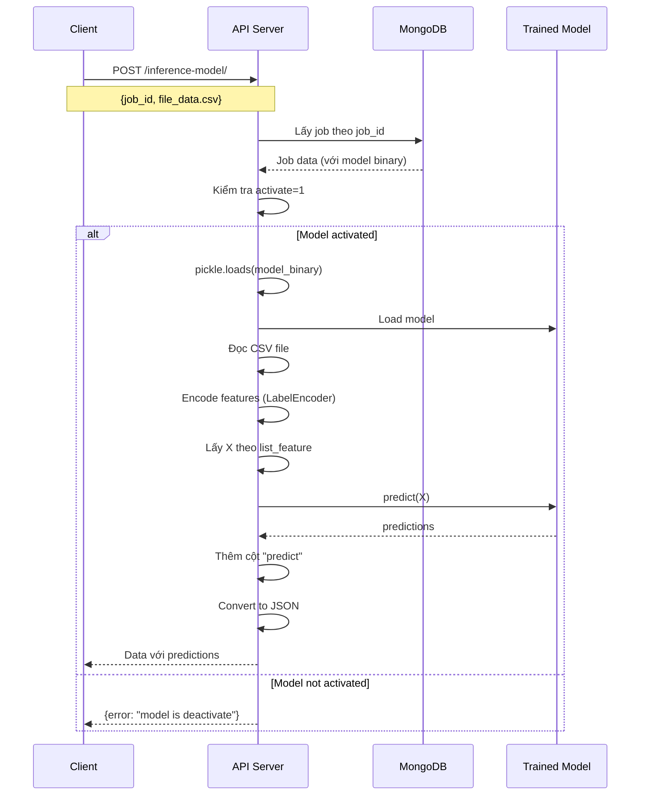
```mermaid
sequenceDiagram
    participant Client
    participant API as API Server
    participant MongoDB
    participant Model as Trained Model
    
    Client->>API: POST /inference-model/
    Note over Client,API: {job_id, file_data.csv}
    
    API->>MongoDB: Lấy job theo job_id
    MongoDB-->>API: Job data (với model binary)
    
    API->>API: Kiểm tra activate=1
    
    alt Model activated
        API->>API: pickle.loads(model_binary)
        API->>Model: Load model
        
        API->>API: Đọc CSV file
        API->>API: Encode features (LabelEncoder)
        API->>API: Lấy X theo list_feature
        
        API->>Model: predict(X)
        Model-->>API: predictions
        
        API->>API: Thêm cột "predict"
        API->>API: Convert to JSON
        
        API-->>Client: Data với predictions
    else Model not activated
        API-->>Client: {error: "model is deactivate"}
    end
```

## 5. Luồng Quản Lý Dataset

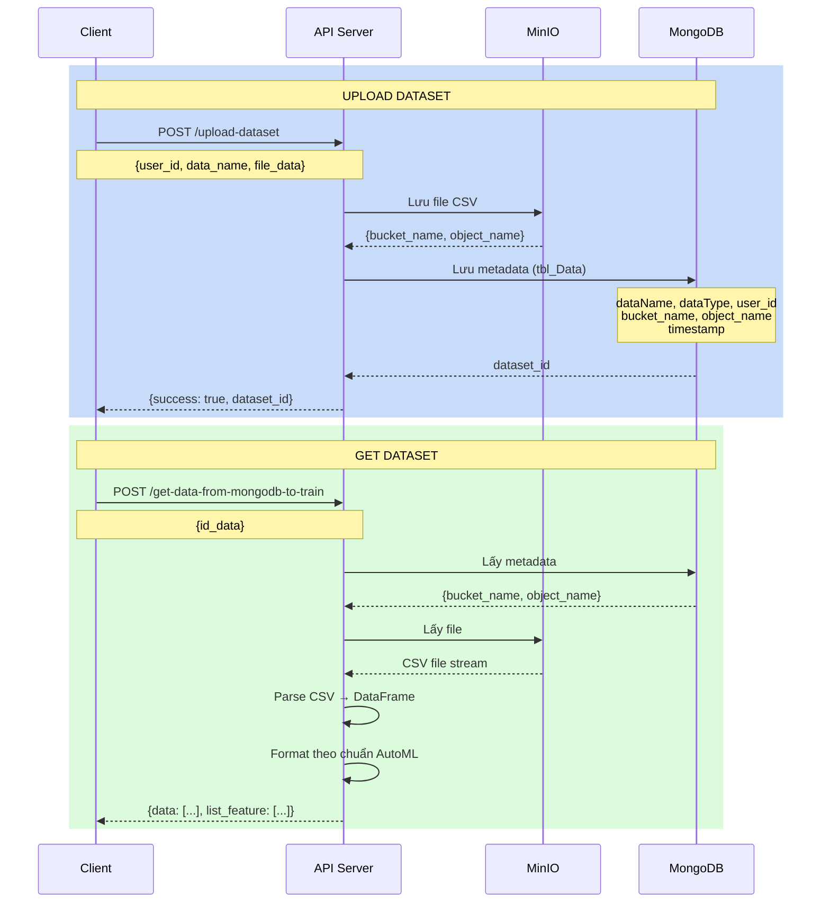
```mermaid
sequenceDiagram
    participant Client
    participant API as API Server
    participant MinIO
    participant MongoDB
    
    rect rgb(200, 220, 250)
        Note over Client,MongoDB: UPLOAD DATASET
        Client->>API: POST /upload-dataset
        Note over Client,API: {user_id, data_name, file_data}
        
        API->>MinIO: Lưu file CSV
        MinIO-->>API: {bucket_name, object_name}
        
        API->>MongoDB: Lưu metadata (tbl_Data)
        Note over MongoDB: dataName, dataType, user_id<br/>bucket_name, object_name<br/>timestamp
        MongoDB-->>API: dataset_id
        
        API-->>Client: {success: true, dataset_id}
    end
    
    rect rgb(220, 250, 220)
        Note over Client,MongoDB: GET DATASET
        Client->>API: POST /get-data-from-mongodb-to-train
        Note over Client,API: {id_data}
        
        API->>MongoDB: Lấy metadata
        MongoDB-->>API: {bucket_name, object_name}
        
        API->>MinIO: Lấy file
        MinIO-->>API: CSV file stream
        
        API->>API: Parse CSV → DataFrame
        API->>API: Format theo chuẩn AutoML
        
        API-->>Client: {data: [...], list_feature: [...]}
    end
```

## 6. Luồng Xác Thực Người Dùng

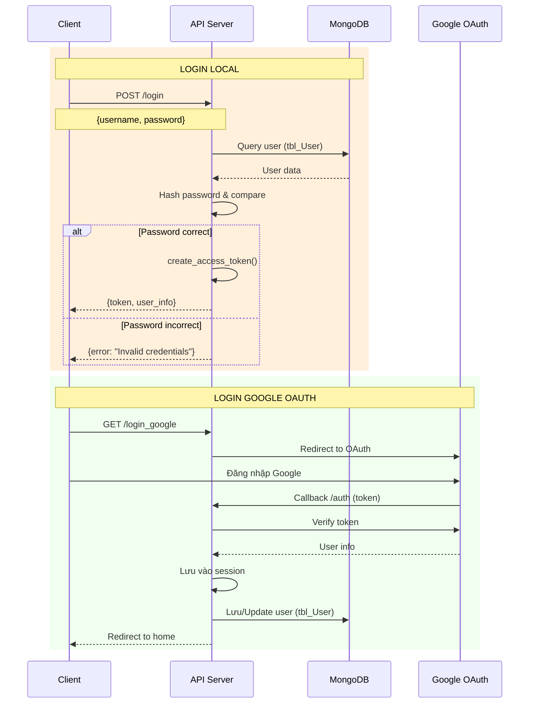
```mermaid
sequenceDiagram
    participant Client
    participant API as API Server
    participant MongoDB
    participant Google as Google OAuth
    
    rect rgb(255, 240, 220)
        Note over Client,MongoDB: LOGIN LOCAL
        Client->>API: POST /login
        Note over Client,API: {username, password}
        
        API->>MongoDB: Query user (tbl_User)
        MongoDB-->>API: User data
        
        API->>API: Hash password & compare
        
        alt Password correct
            API->>API: create_access_token()
            API-->>Client: {token, user_info}
        else Password incorrect
            API-->>Client: {error: "Invalid credentials"}
        end
    end
    
    rect rgb(240, 255, 240)
        Note over Client,Google: LOGIN GOOGLE OAUTH
        Client->>API: GET /login_google
        API->>Google: Redirect to OAuth
        
        Client->>Google: Đăng nhập Google
        Google->>API: Callback /auth (token)
        
        API->>Google: Verify token
        Google-->>API: User info
        
        API->>API: Lưu vào session
        API->>MongoDB: Lưu/Update user (tbl_User)
        
        API-->>Client: Redirect to home
    end
```

## 7. Kiến Trúc Tổng Thể

```mermaid
graph TB
    subgraph "Client Layer"
        WebUI[Web UI]
        GradioUI[Gradio UI]
        APIClient[API Client]
    end
    
    subgraph "API Layer"
        FastAPI[FastAPI Server<br/>app.py]
        ExpAPI[Experiment API<br/>experiment.py]
    end
    
    subgraph "Processing Layer"
        Engine[AutoML Engine<br/>automl/engine.py]
        Factory[SearchStrategyFactory]
        GridSearch[Grid Search]
        Genetic[Genetic Algorithm]
        Bayesian[Bayesian Search]
        
        Factory --> GridSearch
        Factory --> Genetic
        Factory --> Bayesian
    end
    
    subgraph "Worker Layer"
        W1[Worker 1:4000]
        W2[Worker 2:4001]
        W3[Worker 3:4002]
        Coordinator[MapReduce<br/>Coordinator]
        
        Coordinator --> W1
        Coordinator --> W2
        Coordinator --> W3
    end
    
    subgraph "Message Queue"
        Kafka[Apache Kafka]
        Consumer[Kafka Consumer]
        Producer[Kafka Producer]
        
        Producer --> Kafka
        Kafka --> Consumer
    end
    
    subgraph "Storage Layer"
        MongoDB[(MongoDB)]
        MinIO[(MinIO<br/>Object Storage)]
    end
    
    subgraph "External Services"
        GoogleOAuth[Google OAuth]
        UCI[UCI ML Repository]
    end
    
    WebUI --> FastAPI
    GradioUI --> FastAPI
    APIClient --> FastAPI
    APIClient --> ExpAPI
    
    FastAPI --> Engine
    FastAPI --> MongoDB
    FastAPI --> MinIO
    FastAPI --> GoogleOAuth
    FastAPI --> UCI
    
    ExpAPI --> Coordinator
    ExpAPI --> Producer
    
    Engine --> Factory
    Factory --> Engine
    
    Consumer --> Engine
    
    Engine --> MongoDB
    Coordinator --> W1
    Coordinator --> W2
    Coordinator --> W3
    
    W1 --> MongoDB
    W2 --> MongoDB
    W3 --> MongoDB
    
    Engine --> MinIO
    Coordinator --> MinIO
    
    style FastAPI fill:#4A90E2
    style Engine fill:#50C878
    style MongoDB fill:#47A248
    style Kafka fill:#231F20
    style MinIO fill:#C72E49
```

## 8. Luồng Dữ Liệu Chi Tiết

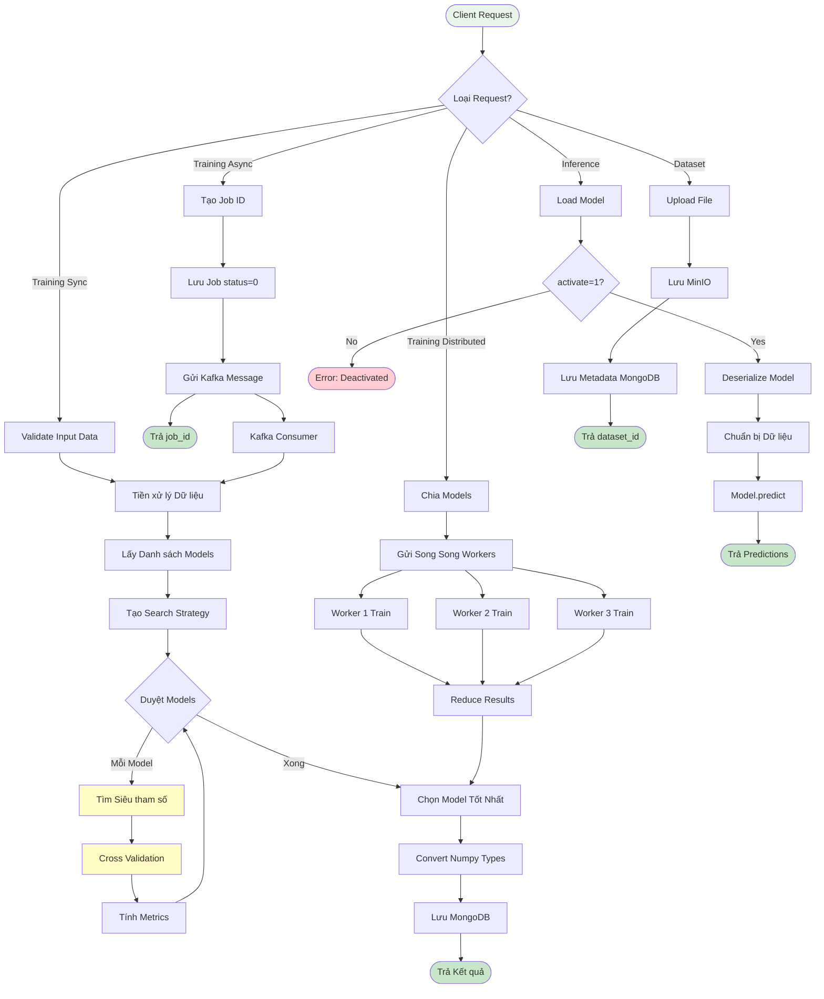
```mermaid
flowchart TD
    Start([Client Request]) --> CheckType{Loại Request?}
    
    CheckType -->|Training Sync| ValidateInput[Validate Input Data]
    CheckType -->|Training Async| CreateJob[Tạo Job ID]
    CheckType -->|Training Distributed| SplitModels[Chia Models]
    CheckType -->|Inference| LoadModel[Load Model]
    CheckType -->|Dataset| UploadFile[Upload File]
    
    ValidateInput --> Preprocess[Tiền xử lý Dữ liệu]
    Preprocess --> GetModels[Lấy Danh sách Models]
    GetModels --> CreateStrategy[Tạo Search Strategy]
    CreateStrategy --> LoopModels{Duyệt Models}
    
    LoopModels -->|Mỗi Model| SearchParams[Tìm Siêu tham số]
    SearchParams --> CrossValidation[Cross Validation]
    CrossValidation --> CalcMetrics[Tính Metrics]
    CalcMetrics --> LoopModels
    
    LoopModels -->|Xong| SelectBest[Chọn Model Tốt Nhất]
    SelectBest --> ConvertTypes[Convert Numpy Types]
    ConvertTypes --> SaveMongo[Lưu MongoDB]
    SaveMongo --> ReturnResult([Trả Kết quả])
    
    CreateJob --> SaveJobPending[Lưu Job status=0]
    SaveJobPending --> SendKafka[Gửi Kafka Message]
    SendKafka --> ReturnJobID([Trả job_id])
    SendKafka --> KafkaConsumer[Kafka Consumer]
    KafkaConsumer --> Preprocess
    
    SplitModels --> SendWorkers[Gửi Song Song Workers]
    SendWorkers --> Worker1[Worker 1 Train]
    SendWorkers --> Worker2[Worker 2 Train]
    SendWorkers --> Worker3[Worker 3 Train]
    Worker1 --> ReduceResults[Reduce Results]
    Worker2 --> ReduceResults
    Worker3 --> ReduceResults
    ReduceResults --> SelectBest
    
    LoadModel --> CheckActivate{activate=1?}
    CheckActivate -->|Yes| Deserialize[Deserialize Model]
    CheckActivate -->|No| ErrorDeactivate([Error: Deactivated])
    Deserialize --> PrepareData[Chuẩn bị Dữ liệu]
    PrepareData --> Predict[Model.predict]
    Predict --> ReturnPrediction([Trả Predictions])
    
    UploadFile --> SaveMinIO[Lưu MinIO]
    SaveMinIO --> SaveMetadata[Lưu Metadata MongoDB]
    SaveMetadata --> ReturnDatasetID([Trả dataset_id])
    
    style Start fill:#E8F5E9
    style ReturnResult fill:#C8E6C9
    style ReturnJobID fill:#C8E6C9
    style ReturnPrediction fill:#C8E6C9
    style ReturnDatasetID fill:#C8E6C9
    style ErrorDeactivate fill:#FFCDD2
    style SearchParams fill:#FFF9C4
    style CrossValidation fill:#FFF9C4
```

## 9. State Machine của Job

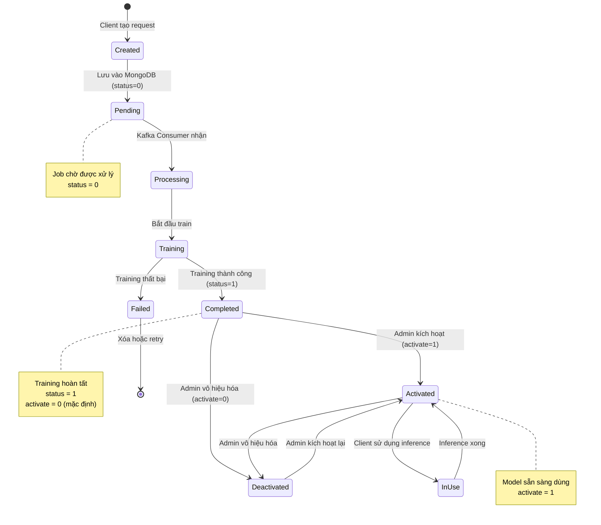
```mermaid
stateDiagram-v2
    [*] --> Created: Client tạo request
    Created --> Pending: Lưu vào MongoDB (status=0)
    Pending --> Processing: Kafka Consumer nhận
    Processing --> Training: Bắt đầu train
    
    Training --> Completed: Training thành công (status=1)
    Training --> Failed: Training thất bại
    
    Completed --> Activated: Admin kích hoạt (activate=1)
    Completed --> Deactivated: Admin vô hiệu hóa (activate=0)
    
    Activated --> InUse: Client sử dụng inference
    InUse --> Activated: Inference xong
    
    Activated --> Deactivated: Admin vô hiệu hóa
    Deactivated --> Activated: Admin kích hoạt lại
    
    Failed --> [*]: Xóa hoặc retry
    
    note right of Pending
        Job chờ được xử lý
        status = 0
    end note
    
    note right of Completed
        Training hoàn tất
        status = 1
        activate = 0 (mặc định)
    end note
    
    note right of Activated
        Model sẵn sàng dùng
        activate = 1
    end note
```

## 10. Component Interaction

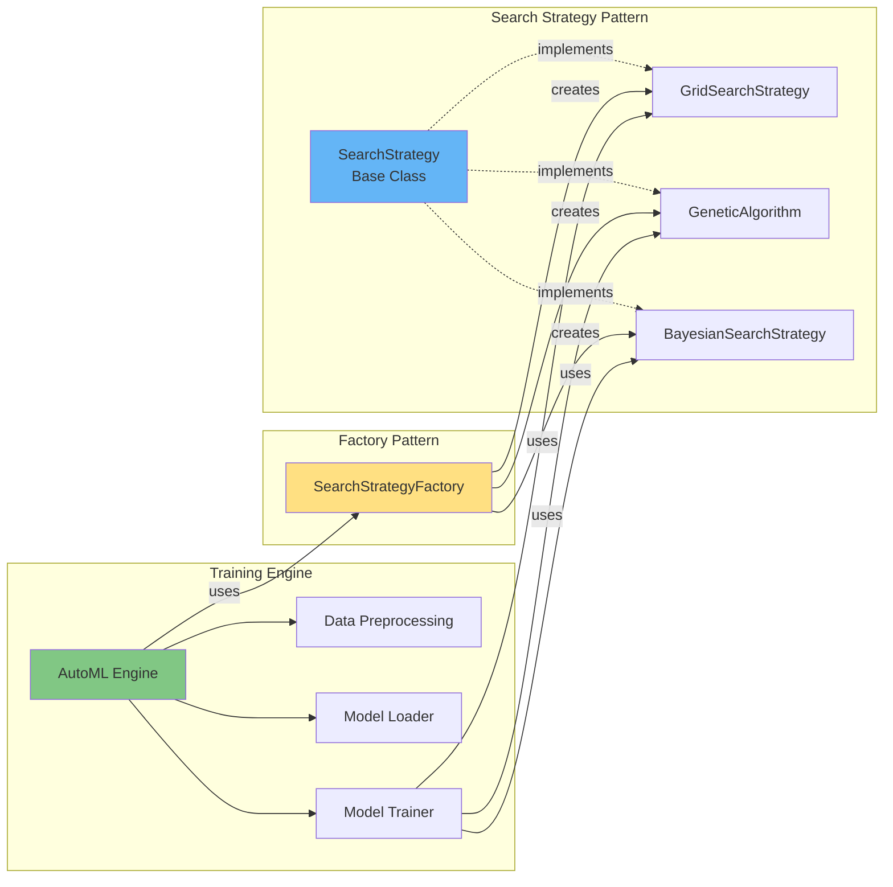
```mermaid
graph LR
    subgraph "Search Strategy Pattern"
        Base[SearchStrategy<br/>Base Class]
        Grid[GridSearchStrategy]
        GA[GeneticAlgorithm]
        Bayes[BayesianSearchStrategy]
        
        Base -.implements.-> Grid
        Base -.implements.-> GA
        Base -.implements.-> Bayes
    end
    
    subgraph "Factory Pattern"
        Factory[SearchStrategyFactory]
        Factory -->|creates| Grid
        Factory -->|creates| GA
        Factory -->|creates| Bayes
    end
    
    subgraph "Training Engine"
        Engine[AutoML Engine]
        Preprocess[Data Preprocessing]
        ModelLoader[Model Loader]
        Trainer[Model Trainer]
        
        Engine --> Preprocess
        Engine --> ModelLoader
        Engine --> Trainer
    end
    
    Engine -->|uses| Factory
    Trainer -->|uses| Grid
    Trainer -->|uses| GA
    Trainer -->|uses| Bayes
    
    style Factory fill:#FFE082
    style Engine fill:#81C784
    style Base fill:#64B5F6
```

## 11. Luồng End-to-End: Từ Người Dùng Đến Response

### 11.1. Luồng Hoàn Chỉnh - Training Đồng Bộ

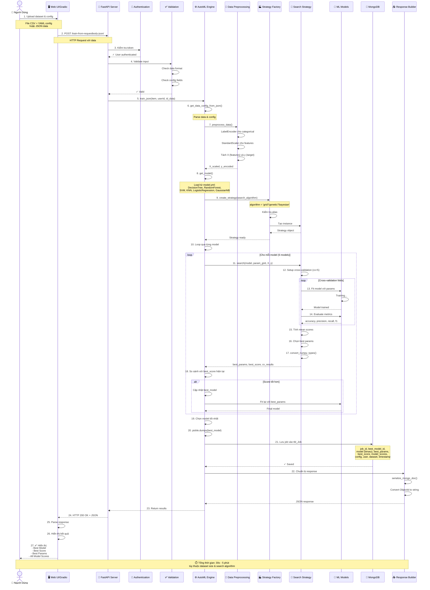
```mermaid
sequenceDiagram
    actor User as 👤 Người Dùng
    participant UI as 🖥️ Web UI/Gradio
    participant API as 🚀 FastAPI Server
    participant Auth as 🔐 Authentication
    participant Validate as ✅ Validation
    participant Engine as ⚙️ AutoML Engine
    participant Preprocess as 🔧 Data Preprocessing
    participant Factory as 🏭 Strategy Factory
    participant Strategy as 🎯 Search Strategy
    participant Models as 🤖 ML Models
    participant Mongo as 💾 MongoDB
    participant Response as 📤 Response Builder
    
    User->>UI: 1. Upload dataset & config
    Note over User,UI: File CSV + YAML config<br/>hoặc JSON data
    
    UI->>API: 2. POST /train-from-requestbody-json/
    Note over UI,API: HTTP Request với data
    
    API->>Auth: 3. Kiểm tra token
    Auth-->>API: ✓ User authenticated
    
    API->>Validate: 4. Validate input
    Validate->>Validate: Check data format
    Validate->>Validate: Check config fields
    Validate-->>API: ✓ Valid
    
    API->>Engine: 5. train_json(item, userId, id_data)
    
    Engine->>Engine: 6. get_data_config_from_json()
    Note over Engine: Parse data & config
    
    Engine->>Preprocess: 7. preprocess_data()
    Preprocess->>Preprocess: LabelEncoder cho categorical
    Preprocess->>Preprocess: StandardScaler cho features
    Preprocess->>Preprocess: Tách X (features) và y (target)
    Preprocess-->>Engine: X_scaled, y_encoded
    
    Engine->>Engine: 8. get_model()
    Note over Engine: Load từ model.yml:<br/>DecisionTree, RandomForest,<br/>SVM, KNN, LogisticRegression, GaussianNB
    
    Engine->>Factory: 9. create_strategy(search_algorithm)
    Note over Factory: algorithm = 'grid'/'genetic'/'bayesian'
    Factory->>Factory: Kiểm tra alias
    Factory->>Strategy: Tạo instance
    Strategy-->>Factory: Strategy object
    Factory-->>Engine: Strategy ready
    
    Engine->>Engine: 10. Loop qua từng model
    
    loop Cho mỗi model (6 models)
        Engine->>Strategy: 11. search(model, param_grid, X, y)
        
        Strategy->>Strategy: 12. Setup cross-validation (cv=5)
        
        loop Cross-validation folds
            Strategy->>Models: 13. Fit model với params
            Models->>Models: Training...
            Models-->>Strategy: Model trained
            
            Strategy->>Models: 14. Evaluate metrics
            Models-->>Strategy: accuracy, precision, recall, f1
        end
        
        Strategy->>Strategy: 15. Tính mean scores
        Strategy->>Strategy: 16. Chọn best params
        Strategy->>Strategy: 17. convert_numpy_types()
        Strategy-->>Engine: best_params, best_score, cv_results
        
        Engine->>Engine: 18. So sánh với best_score hiện tại
        
        alt Score tốt hơn
            Engine->>Engine: Cập nhật best_model
            Engine->>Models: Fit lại với best_params
            Models-->>Engine: Final model
        end
    end
    
    Engine->>Engine: 19. Chọn model tốt nhất
    Engine->>Engine: 20. pickle.dumps(best_model)
    
    Engine->>Mongo: 21. Lưu job vào tbl_Job
    Note over Mongo: job_id, best_model_id,<br/>model (binary), best_params,<br/>best_score, model_scores,<br/>config, user, dataset, timestamp
    Mongo-->>Engine: ✓ Saved
    
    Engine->>Response: 22. Chuẩn bị response
    Response->>Response: serialize_mongo_doc()
    Response->>Response: Convert ObjectId to string
    Response-->>Engine: JSON response
    
    Engine-->>API: 23. Return results
    API-->>UI: 24. HTTP 200 OK + JSON
    
    UI->>UI: 25. Parse response
    UI->>UI: 26. Hiển thị kết quả
    
    UI-->>User: 27. ✅ Hiển thị:<br/>- Best Model<br/>- Best Score<br/>- Best Params<br/>- All Model Scores
    
    Note over User,Response: ⏱️ Tổng thời gian: 30s - 5 phút<br/>tùy thuộc dataset size & search algorithm
```

### 11.2. Luồng End-to-End - Training Bất Đồng Bộ

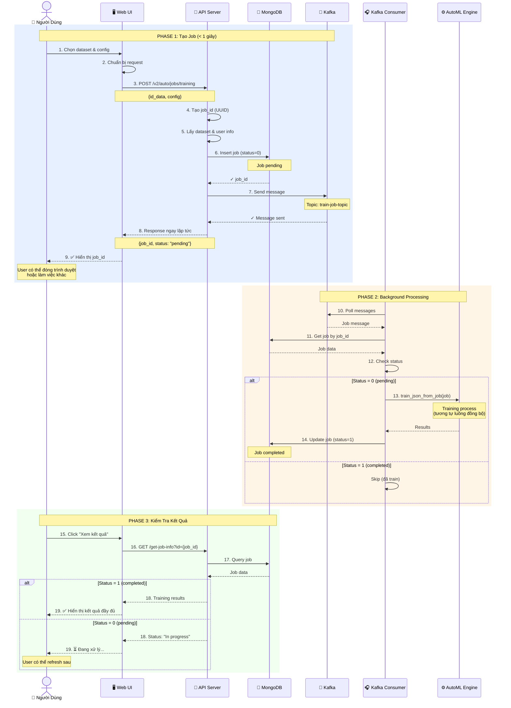
```mermaid
sequenceDiagram
    actor User as 👤 Người Dùng
    participant UI as 🖥️ Web UI
    participant API as 🚀 API Server
    participant Mongo as 💾 MongoDB
    participant Kafka as 📨 Kafka
    participant Consumer as 🎧 Kafka Consumer
    participant Engine as ⚙️ AutoML Engine
    
    rect rgb(230, 240, 255)
        Note over User,Kafka: PHASE 1: Tạo Job (< 1 giây)
        
        User->>UI: 1. Chọn dataset & config
        UI->>UI: 2. Chuẩn bị request
        
        UI->>API: 3. POST /v2/auto/jobs/training
        Note over UI,API: {id_data, config}
        
        API->>API: 4. Tạo job_id (UUID)
        API->>API: 5. Lấy dataset & user info
        
        API->>Mongo: 6. Insert job (status=0)
        Note over Mongo: Job pending
        Mongo-->>API: ✓ job_id
        
        API->>Kafka: 7. Send message
        Note over Kafka: Topic: train-job-topic
        Kafka-->>API: ✓ Message sent
        
        API-->>UI: 8. Response ngay lập tức
        Note over API,UI: {job_id, status: "pending"}
        
        UI-->>User: 9. ✅ Hiển thị job_id
        Note over User: User có thể đóng trình duyệt<br/>hoặc làm việc khác
    end
    
    rect rgb(255, 245, 230)
        Note over Kafka,Engine: PHASE 2: Background Processing
        
        Consumer->>Kafka: 10. Poll messages
        Kafka-->>Consumer: Job message
        
        Consumer->>Mongo: 11. Get job by job_id
        Mongo-->>Consumer: Job data
        
        Consumer->>Consumer: 12. Check status
        
        alt Status = 0 (pending)
            Consumer->>Engine: 13. train_json_from_job(job)
            Note over Engine: Training process<br/>(tương tự luồng đồng bộ)
            Engine-->>Consumer: Results
            
            Consumer->>Mongo: 14. Update job (status=1)
            Note over Mongo: Job completed
        else Status = 1 (completed)
            Consumer->>Consumer: Skip (đã train)
        end
    end
    
    rect rgb(240, 255, 240)
        Note over User,Mongo: PHASE 3: Kiểm Tra Kết Quả
        
        User->>UI: 15. Click "Xem kết quả"
        UI->>API: 16. GET /get-job-info?id={job_id}
        
        API->>Mongo: 17. Query job
        Mongo-->>API: Job data
        
        alt Status = 1 (completed)
            API-->>UI: 18. Training results
            UI-->>User: 19. ✅ Hiển thị kết quả đầy đủ
        else Status = 0 (pending)
            API-->>UI: 18. Status: "In progress"
            UI-->>User: 19. ⏳ Đang xử lý...
            Note over User: User có thể refresh sau
        end
    end
```

### 11.3. Luồng End-to-End - Inference (Dự Đoán)

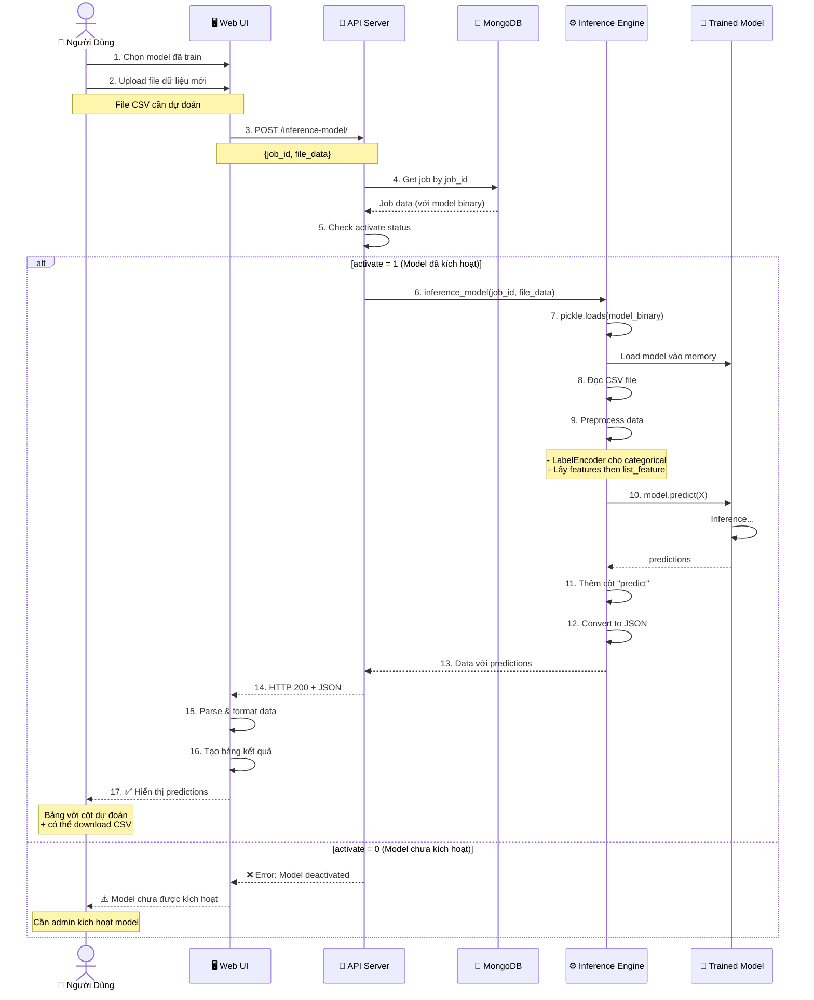
```mermaid
sequenceDiagram
    actor User as 👤 Người Dùng
    participant UI as 🖥️ Web UI
    participant API as 🚀 API Server
    participant Mongo as 💾 MongoDB
    participant Engine as ⚙️ Inference Engine
    participant Model as 🤖 Trained Model
    
    User->>UI: 1. Chọn model đã train
    User->>UI: 2. Upload file dữ liệu mới
    Note over User,UI: File CSV cần dự đoán
    
    UI->>API: 3. POST /inference-model/
    Note over UI,API: {job_id, file_data}
    
    API->>Mongo: 4. Get job by job_id
    Mongo-->>API: Job data (với model binary)
    
    API->>API: 5. Check activate status
    
    alt activate = 1 (Model đã kích hoạt)
        API->>Engine: 6. inference_model(job_id, file_data)
        
        Engine->>Engine: 7. pickle.loads(model_binary)
        Engine->>Model: Load model vào memory
        
        Engine->>Engine: 8. Đọc CSV file
        Engine->>Engine: 9. Preprocess data
        Note over Engine: - LabelEncoder cho categorical<br/>- Lấy features theo list_feature
        
        Engine->>Model: 10. model.predict(X)
        Model->>Model: Inference...
        Model-->>Engine: predictions
        
        Engine->>Engine: 11. Thêm cột "predict"
        Engine->>Engine: 12. Convert to JSON
        
        Engine-->>API: 13. Data với predictions
        API-->>UI: 14. HTTP 200 + JSON
        
        UI->>UI: 15. Parse & format data
        UI->>UI: 16. Tạo bảng kết quả
        
        UI-->>User: 17. ✅ Hiển thị predictions
        Note over User: Bảng với cột dự đoán<br/>+ có thể download CSV
        
    else activate = 0 (Model chưa kích hoạt)
        API-->>UI: ❌ Error: Model deactivated
        UI-->>User: ⚠️ Model chưa được kích hoạt
        Note over User: Cần admin kích hoạt model
    end
```

### 11.4. Luồng End-to-End - Upload & Train Dataset

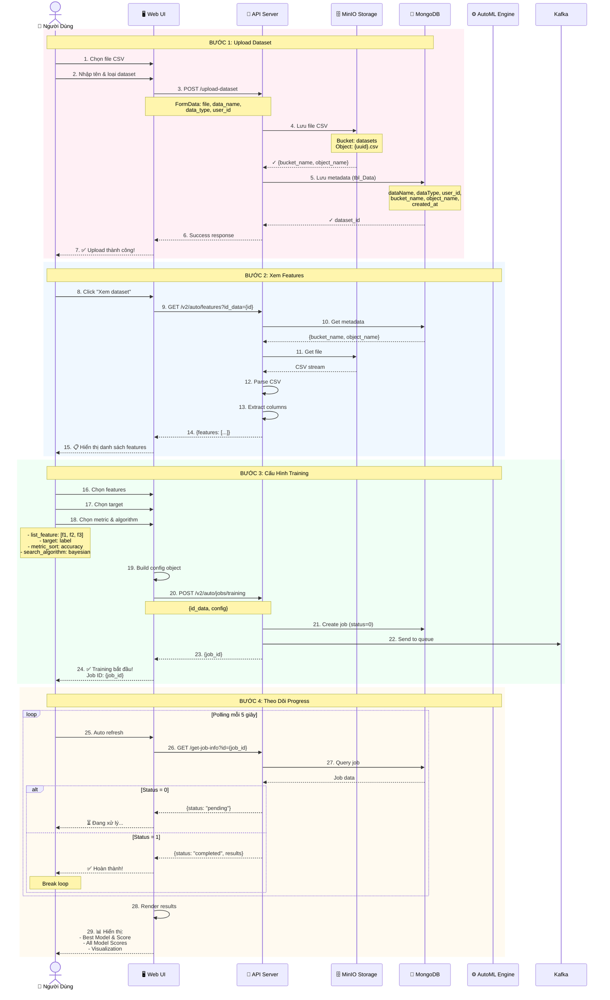
```mermaid
sequenceDiagram
    actor User as 👤 Người Dùng
    participant UI as 🖥️ Web UI
    participant API as 🚀 API Server
    participant MinIO as 🗄️ MinIO Storage
    participant Mongo as 💾 MongoDB
    participant Engine as ⚙️ AutoML Engine
    
    rect rgb(255, 240, 245)
        Note over User,Mongo: BƯỚC 1: Upload Dataset
        
        User->>UI: 1. Chọn file CSV
        User->>UI: 2. Nhập tên & loại dataset
        
        UI->>API: 3. POST /upload-dataset
        Note over UI,API: FormData: file, data_name,<br/>data_type, user_id
        
        API->>MinIO: 4. Lưu file CSV
        Note over MinIO: Bucket: datasets<br/>Object: {uuid}.csv
        MinIO-->>API: ✓ {bucket_name, object_name}
        
        API->>Mongo: 5. Lưu metadata (tbl_Data)
        Note over Mongo: dataName, dataType, user_id,<br/>bucket_name, object_name,<br/>created_at
        Mongo-->>API: ✓ dataset_id
        
        API-->>UI: 6. Success response
        UI-->>User: 7. ✅ Upload thành công!
    end
    
    rect rgb(240, 248, 255)
        Note over User,Engine: BƯỚC 2: Xem Features
        
        User->>UI: 8. Click "Xem dataset"
        UI->>API: 9. GET /v2/auto/features?id_data={id}
        
        API->>Mongo: 10. Get metadata
        Mongo-->>API: {bucket_name, object_name}
        
        API->>MinIO: 11. Get file
        MinIO-->>API: CSV stream
        
        API->>API: 12. Parse CSV
        API->>API: 13. Extract columns
        
        API-->>UI: 14. {features: [...]}
        UI-->>User: 15. 📋 Hiển thị danh sách features
    end
    
    rect rgb(240, 255, 245)
        Note over User,Engine: BƯỚC 3: Cấu Hình Training
        
        User->>UI: 16. Chọn features
        User->>UI: 17. Chọn target
        User->>UI: 18. Chọn metric & algorithm
        Note over User: - list_feature: [f1, f2, f3]<br/>- target: label<br/>- metric_sort: accuracy<br/>- search_algorithm: bayesian
        
        UI->>UI: 19. Build config object
        
        UI->>API: 20. POST /v2/auto/jobs/training
        Note over UI,API: {id_data, config}
        
        API->>Mongo: 21. Create job (status=0)
        API->>Kafka: 22. Send to queue
        
        API-->>UI: 23. {job_id}
        UI-->>User: 24. ✅ Training bắt đầu!<br/>Job ID: {job_id}
    end
    
    rect rgb(255, 250, 240)
        Note over User,Engine: BƯỚC 4: Theo Dõi Progress
        
        loop Polling mỗi 5 giây
            User->>UI: 25. Auto refresh
            UI->>API: 26. GET /get-job-info?id={job_id}
            
            API->>Mongo: 27. Query job
            Mongo-->>API: Job data
            
            alt Status = 0
                API-->>UI: {status: "pending"}
                UI-->>User: ⏳ Đang xử lý...
            else Status = 1
                API-->>UI: {status: "completed", results}
                UI-->>User: ✅ Hoàn thành!
                Note over User: Break loop
            end
        end
        
        UI->>UI: 28. Render results
        UI-->>User: 29. 📊 Hiển thị:<br/>- Best Model & Score<br/>- All Model Scores<br/>- Visualization
    end
```

### 11.5. Luồng Tương Tác Người Dùng - Dashboard View

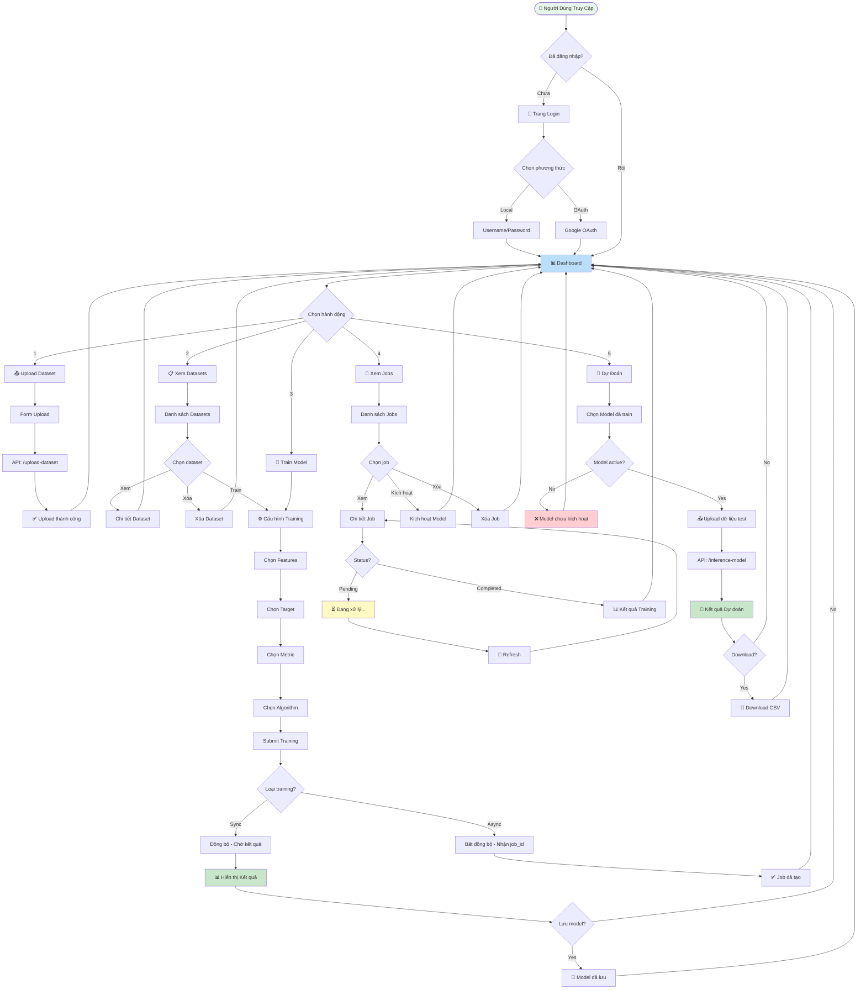
```mermaid
graph TD
    Start([👤 Người Dùng Truy Cập]) --> Login{Đã đăng nhập?}
    
    Login -->|Chưa| LoginPage[🔐 Trang Login]
    LoginPage --> LoginChoice{Chọn phương thức}
    LoginChoice -->|Local| LocalAuth[Username/Password]
    LoginChoice -->|OAuth| GoogleAuth[Google OAuth]
    
    LocalAuth --> Dashboard
    GoogleAuth --> Dashboard
    
    Login -->|Rồi| Dashboard[📊 Dashboard]
    
    Dashboard --> Action{Chọn hành động}
    
    Action -->|1| UploadData[📤 Upload Dataset]
    Action -->|2| ViewData[📋 Xem Datasets]
    Action -->|3| TrainModel[🎯 Train Model]
    Action -->|4| ViewJobs[📝 Xem Jobs]
    Action -->|5| UseModel[🔮 Dự Đoán]
    
    UploadData --> UploadForm[Form Upload]
    UploadForm --> UploadAPI[API: /upload-dataset]
    UploadAPI --> UploadSuccess[✅ Upload thành công]
    UploadSuccess --> Dashboard
    
    ViewData --> DataList[Danh sách Datasets]
    DataList --> SelectData{Chọn dataset}
    SelectData -->|Xem| ViewDetail[Chi tiết Dataset]
    SelectData -->|Xóa| DeleteData[Xóa Dataset]
    SelectData -->|Train| ConfigTrain
    ViewDetail --> Dashboard
    DeleteData --> Dashboard
    
    TrainModel --> ConfigTrain[⚙️ Cấu hình Training]
    ConfigTrain --> SelectFeatures[Chọn Features]
    SelectFeatures --> SelectTarget[Chọn Target]
    SelectTarget --> SelectMetric[Chọn Metric]
    SelectMetric --> SelectAlgo[Chọn Algorithm]
    SelectAlgo --> SubmitTrain[Submit Training]
    
    SubmitTrain --> TrainType{Loại training?}
    TrainType -->|Sync| SyncTrain[Đồng bộ - Chờ kết quả]
    TrainType -->|Async| AsyncTrain[Bất đồng bộ - Nhận job_id]
    
    SyncTrain --> ShowResults[📊 Hiển thị Kết quả]
    AsyncTrain --> JobCreated[✅ Job đã tạo]
    JobCreated --> Dashboard
    
    ShowResults --> SaveModel{Lưu model?}
    SaveModel -->|Yes| ModelSaved[💾 Model đã lưu]
    SaveModel -->|No| Dashboard
    ModelSaved --> Dashboard
    
    ViewJobs --> JobList[Danh sách Jobs]
    JobList --> SelectJob{Chọn job}
    SelectJob -->|Xem| JobDetail[Chi tiết Job]
    SelectJob -->|Kích hoạt| ActivateModel[Kích hoạt Model]
    SelectJob -->|Xóa| DeleteJob[Xóa Job]
    
    JobDetail --> JobStatus{Status?}
    JobStatus -->|Pending| Waiting[⏳ Đang xử lý...]
    JobStatus -->|Completed| JobResults[📊 Kết quả Training]
    
    Waiting --> Refresh[🔄 Refresh]
    Refresh --> JobDetail
    
    JobResults --> Dashboard
    ActivateModel --> Dashboard
    DeleteJob --> Dashboard
    
    UseModel --> SelectModel[Chọn Model đã train]
    SelectModel --> CheckActive{Model active?}
    CheckActive -->|No| ErrorInactive[❌ Model chưa kích hoạt]
    CheckActive -->|Yes| UploadTestData[📤 Upload dữ liệu test]
    
    ErrorInactive --> Dashboard
    
    UploadTestData --> InferenceAPI[API: /inference-model]
    InferenceAPI --> Predictions[🔮 Kết quả Dự đoán]
    Predictions --> DownloadResult{Download?}
    DownloadResult -->|Yes| DownloadCSV[💾 Download CSV]
    DownloadResult -->|No| Dashboard
    DownloadCSV --> Dashboard
    
    style Start fill:#E8F5E9
    style Dashboard fill:#BBDEFB
    style ShowResults fill:#C8E6C9
    style Predictions fill:#C8E6C9
    style ErrorInactive fill:#FFCDD2
    style Waiting fill:#FFF9C4
```
